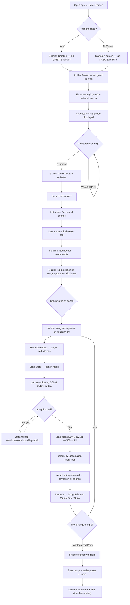
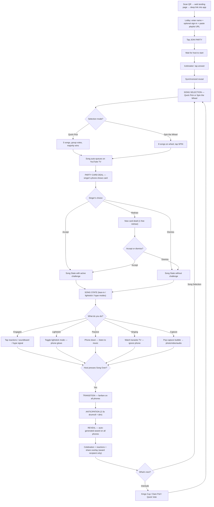

# UX Design Specification karaoke-party-app

**Author:** Ducdo
**Date:** 2026-03-04

---

<!-- UX design content will be appended sequentially through collaborative workflow steps -->

## Executive Summary

### Project Vision

Karamania is a second-screen native mobile app (Flutter, iOS + Android) that transforms group karaoke nights from interactive party experiences into full entertainment sessions. Users join via QR code scan or party code — a lightweight web landing page deep-links into the installed app or redirects to the app store for first-time users. Optional accounts (Google/Facebook OAuth or guest with name-only). Phones become participation devices: reactions, soundboards, party card challenges, lightstick mode, song discovery, ceremonies, and mini-games that keep the entire room engaged before, during, and between songs.

The app occupies genuine white space: no competitor serves as a companion layer for in-room group karaoke. By not playing music, Karamania sidesteps music licensing entirely and works at any venue. As a native app, Karamania delivers reliable background connectivity, seamless media capture on both platforms, push notifications, and consistent performance. Two interconnected engines power the experience: (1) a server-authoritative DJ engine that automatically orchestrates party flow (party card deal → song → ceremony → interlude → repeat), eliminating dead air and freeing the host from MC duties, and (2) a Song Integration Engine that pairs with the YouTube TV via the Lounge API, passively detects every song played, imports friends' playlists, and surfaces personalized suggestions through Quick Pick voting and Spin the Wheel — eliminating "what should we sing?" decision fatigue.

Target market: Vietnamese friend groups (ages 20-35) at commercial karaoke venues in HCMC and Hanoi. MVP built by solo developer in ~8 weeks. Success metric: >80% "Would use again" post-session score.

### Target Users

**Primary Personas (Priority Order):**

1. **Linh — "The Party Starter" (Host):** 25, marketing coordinator. Organizes karaoke nights but burns out managing everything. Needs the app to run the party so she can be a guest at her own event. She is the acquisition bottleneck — every other persona is downstream of her decision to use the app. Has a unique triple-attention problem: watching the karaoke screen, watching friends, AND monitoring her phone for the "Song Over!" trigger.

2. **Minh — "The Hype Friend" (Active Non-Singer):** 23, design student. Loves the energy, doesn't sing. Currently disengages after song three. Needs participation tools (soundboard, reactions, hype streaks, interludes) that are just as engaging as singing. Proof the app works.

3. **Duc — "The Performer" (Spotlight Seeker):** 27, sales rep. Wants his performances to be events with crowd reactions, ceremony awards, and shareable moment cards. Content generator for the viral flywheel.

4. **Trang — "The Reluctant Star" (Shy Joiner):** 22, accounting student. Goes because friends drag her. Design litmus test: if the app works for Trang, it works for everyone. Needs an engagement ladder (reactions → interludes → song picks → group anthem) with zero forced participation.

**Secondary:** Late joiners (mid-session onboarding), disconnected users (transparent reconnection), solo host testing (first-time exploration).

**Design Principles from User Research:**
- Design for 60-70% room adoption, not 100%
- Minimum viable party size: 2-3 people must still be fun
- Group size variation: 4 friends vs. 12 colleagues are different experiences
- Battery consciousness: 2-3 hour sessions with WebSocket + native audio + screen-on. Adaptive heartbeat (5s active → 15s song) + wake lock release during song state

### Key Design Challenges

1. **Dual-Attention Environment & The Passive/Active Mode Paradigm:** The karaoke TV is the primary screen; the phone is secondary. This creates two fundamentally different interaction modes that every feature must be designed for:
   - **Passive mode** (during songs): Phone is face-down or in a pocket. Audio cues are the ENTIRE interface. Sound design must communicate state changes, prompt attention, and create atmosphere without any visual engagement. Reactions and soundboard are optional — users tap when moved to, not when prompted.
   - **Active mode** (ceremony, voting, interludes): Screen is primary. Users are looking and tapping. Visual design must be glanceable — instant comprehension in a dim room at arm's length. This is where transition animations, countdown timers, and tap interactions live.
   - Every feature must be tagged as passive-mode or active-mode, because the interaction patterns are fundamentally different.

2. **The Host's "Song Over!" Trigger — A Unique Dual-Attention Problem:** Linh has a triple-attention burden: karaoke screen, friends, AND her phone. The "Song Over!" button is the single most critical host interaction — it bridges the physical karaoke performance to the digital ceremony. This trigger must be: (a) impossible to miss when needed, (b) impossible to accidentally trigger during normal participation, and (c) operable with zero visual search time. This is a specific interaction design problem that requires dedicated exploration.

3. **Zero-Onboarding Requirement:** No tutorials, no instruction screens. Users are socializing, tipsy, and distracted. Every interaction must be self-evident. The icebreaker IS the onboarding — "Tap your favorite decade" teaches the app through play.

4. **Drunk-User-Friendly Interaction Design:** By mid-session, fine motor control degrades. All primary interactions require a single tap on targets no smaller than 48x48px (prefer 56x56px+). No text input beyond initial name entry. No precision, no multi-step flows.

5. **Choreographed Reveals — State Synchronization as UX:** When a ceremony reveals an award, all 8 phones must show the reveal within a 200ms window of each other. If Duc sees "Vocal Assassin" while Minh's phone still shows the anticipation screen, the collective room reaction is destroyed. Ceremony reveals and major DJ transitions must use server-coordinated reveal timing (server sends future timestamp, clients schedule synchronized display). The room reaction IS the product — desynchronized reveals kill the magic.

6. **Physical-Digital Synchronization:** The DJ engine cycles automatically while real-world events happen asynchronously (mic handoffs, food breaks, bathroom runs). Bridge moment activities and pause states must feel natural, not robotic. The 90-second inactivity auto-pause prevents the app from talking to an empty room.

7. **App Download Friction for Join Flow:** Unlike a PWA, Karamania requires the app to be installed. The web landing page must minimize this friction: clean design, fast platform detection, deep-link into installed app, or quick app store redirect with "Download to join the party" messaging. Small app size (<50MB) and fast cold start (<3s) mitigate the friction. Once installed, subsequent joins are instant via deep link.

### Design Opportunities

1. **Transition Design as Core Differentiator:** The 2-second animated transitions + sound cues between DJ states are where the magic lives. A hard screen cut feels broken; a dramatic fanfare → countdown → reveal feels like a show. Design transitions BEFORE screens. The in-between moments matter more than the features themselves. All major transitions must be choreographed reveals with server-coordinated timing.

2. **Collective Audio Atmosphere:** 8 phones in a room, each playing synchronized sound effects — air horns, fanfares, crowd roars. The room becomes the speaker system. Host phone serves as primary audio for big ceremony moments. No existing product creates this multi-device audio experience. Audio design is the primary UX in passive mode — it must carry the entire experience when screens are face-down.

3. **Share-First Artifact Design:** Every post-song ceremony generates a moment card; every end-of-night produces a setlist poster. These are the primary acquisition channel — the PRD targets >1 share intent per session as a go/no-go gate. Artifacts must be designed as Instagram Story dimensions (9:16), pre-styled with the Karamania brand subtle but visible, and one-tap to native share sheet. Don't make users screenshot and crop. The share flow must be 2 taps or fewer from artifact → shared. 47% of Gen Z create karaoke content; meet them where they are.

## Core User Experience

### Defining Experience

The core experience of Karamania is **synchronized collective moments** — every phone in the room doing the same thing at the same time, creating a shared experience that transcends individual screens. The product's value is proven in the 10-second post-song ceremony: a fanfare erupts from 8 phones, a drumroll builds anticipation, and an auto-generated award reveals in perfect sync. That collective gasp IS the product.

**The Core Loop:**
Song Selection (Quick Pick / Spin the Wheel) → Party Card Deal → Song (passive/lean-in mode) → "Song Over!" trigger → Ceremony (active mode) → Interlude/Vote → Song Selection → Party Card Deal → Song

Song Selection replaces the "what should we sing?" negotiation. The Suggestion Engine surfaces songs the group collectively knows that have karaoke versions — Quick Pick (5 cards, group votes, 15s auto-advance) or Spin the Wheel (8 picks, animated selection, one veto). Selected songs auto-queue on the YouTube TV via the Lounge API. No one types anything into the karaoke machine.

The Party Card Deal is a pre-song micro-moment: the DJ auto-deals a challenge card to the next singer. Accept, dismiss, or one free redraw — then walk to the mic. It adds unpredictability to every performance and gives the audience something to watch for ("Will they do the dare?").

The Song → Ceremony transition is the highest-priority interaction in the entire app. It's where dead air dies, content is born, and the room becomes connected. Every other feature exists to create the conditions for this moment to land repeatedly without losing its magic.

**The Invisible Engine:**
Beneath the loud moments, the DJ engine's quiet orchestration is what brings hosts back. Linh's "I haven't managed anything for 45 minutes" is the retention moment. The bridge activities during physical transitions (mic handoffs, song selection), the natural-feeling pauses, the auto-cycling that just keeps things moving — this invisible layer is the foundation. If the orchestration feels robotic, hosts reach for manual controls and become the MC again. Design quiet transitions with the same obsession as loud reveals.

### Platform Strategy

**Platform:** Flutter native app (iOS + Android), portrait orientation exclusively
**Viewport:** 320px (iPhone SE) to 428px (iPhone 14 Pro Max)
**Primary platforms:** Android (60-70% expected), iOS (20-30%)
**Input:** Touch-only, single-tap interactions (except host "Song Over!" which uses long-press), no keyboard beyond name entry and TV pairing code
**Connectivity:** Persistent WebSocket (socket_io_client), aggressive reconnection, no offline mode (real-time multiplayer requires connection)
**Audio:** Native audio engine (just_audio/audioplayers) with bundled assets — audio is the mode-transition trigger, not a nice-to-have. No browser AudioContext restrictions — audio plays immediately on any interaction
**Install:** App Store + Google Play distribution. QR scan → web landing page → deep link into app (if installed) or app store redirect (if not)

**Platform Advantages Over PWA:**
- Push notifications available for party invites and morning-after highlights
- Background WebSocket connectivity — app maintains connection when backgrounded
- Native camera/microphone access — uniform photo, video (5s), and audio capture on both platforms
- Native wake lock via wakelock_plus — uniform across iOS and Android
- Native flashlight API for camera flash hype signal — works on both platforms
- Consistent performance — no browser variability

**Platform Constraints Driving Design:**
- App download required for first-time join — web landing page mitigates friction
- 4G network in karaoke room basements — optimize for intermittent connectivity
- Budget Android devices dominant in Vietnam market — test on 3-year-old hardware. Share-worthy artifacts (moment cards, setlist posters) need defensive design: text truncation, dynamic font scaling, overflow handling for long display names. Test on worst device in the room, not the best
- Battery optimization critical for 2-3 hour sessions — adaptive heartbeat (5s active → 15s song), wake lock release during song state

**Join Flow — Two Paths:**

**Path A: App already installed (returning user / has app):**
- QR scan → web landing page opens (1-2s)
- Deep link fires → app opens with party code pre-filled (1s)
- Optional: sign in or continue as guest (0-10s)
- Name entry (if guest): 5-10s
- WebSocket connect: 0.5s
- In the party. Total: ~10-15s

**Path B: First-time user (app not installed):**
- QR scan → web landing page opens (1-2s)
- Deep link fails → "Download Karamania to join!" with app store button
- App store → download → install (~30-60s on 4G, <50MB app)
- Open app → party code pre-filled via deferred deep link
- Name entry: 5-10s
- In the party. First-time friction accepted — all subsequent joins use Path A

The "3 friends are waiting for you" loading state is anticipation camouflage — the lobby shows social proof while the WebSocket connects. Perceived speed matters more than actual speed.

### Effortless Interactions

**Join (must feel instant for returning users):**
QR scan → deep link into app → enter name → in the party. Under 15 seconds for returning users. First-time download adds friction but is a one-time cost. The loading state shows "3 friends are waiting for you" — social proof while WebSocket connects. The icebreaker fires immediately, teaching the app through play. No tutorial, no walkthrough. Optional sign-in (Google/Facebook) is non-blocking — users can join as guest and upgrade later.

**React (must feel instinctive):**
Single tap to send an emoji reaction. No selection menu for the primary reaction — tap the big button, emoji flies. Soundboard is 4-6 large buttons, always visible during song state. The phone is a game controller, not an app. Reaction UI designed for peripheral vision and quick glances — big, colorful, high-contrast, readable in a dim room at arm's length.

**Celebrate (must feel automatic):**
Ceremony awards are auto-generated from session context — no voting required. The host taps "Song Over!" and the app handles everything: anticipation build → award reveal → celebration. Awards are driven by party card completion, reaction volume, song position, and performer stats. Pure celebration, zero decision fatigue for participants.

**Host "Song Over!" trigger (must be deliberate but fast):**
500ms long-press with a satisfying fill animation + haptic feedback. Deliberate enough to prevent accidental triggers during frantic reaction tapping, but faster than a confirmation dialog. The fill animation gives Linh visual confirmation she's triggering it — finger down, circle fills, release at full, ceremony fires. No undo needed because the gesture itself prevents accidents. This replaces a single tap to solve the accidental-trigger problem without adding friction.

**Host controls (must feel invisible):**
Other host controls (skip, pause, next) are a minimal expandable overlay. One-thumb operation. The host's screen looks like every other player's screen plus a subtle control layer. Host stays a player, never becomes a manager.

**Share (must feel immediate):**
Moment card appears → one tap → native share sheet. No cropping, no editing, no save-then-share. The artifact is pre-designed at 9:16 Instagram Story dimensions with the Karamania brand visible but not dominant. Two taps maximum from artifact to shared. Artifacts use defensive rendering: text truncation for long names, dynamic font scaling, overflow protection — ensuring share-worthiness across all device sizes and display name lengths.

### Critical Success Moments

**1. The First Ceremony (The Aha Moment)**
When the first song ends and every phone erupts simultaneously — this is when the room understands what Karamania is. Design the first ceremony of each session with an extra beat of suspense and a slightly longer reveal. Awards are auto-generated from session context (party card completion, reaction volume, song position) — fun/random titles from a pool of 20+ templates, not performance ratings. The first ceremony tone must be **celebratory-neutral** — "THE FIRST SONG IS IN THE BOOKS!" rather than performance-quality-dependent praise. Celebrate the milestone, not the quality. If the first ceremony doesn't make Trang look up from Instagram, the app has failed.

**2. Linh's 45-Minute Realization (The Retention Moment)**
The moment Linh realizes she hasn't managed anything for 45 minutes. This isn't a visible UI event — it's the absence of friction. The DJ engine cycled through activities, bridge moments filled physical transitions, and Linh just... played. This invisible success determines whether she creates a second party. Design the DJ flow so smooth that host intervention feels optional, not required.

**3. Minh's Hype Streak (The Engagement Proof)**
Minh hits a reaction streak, "MINH IS ON FIRE" flashes on his screen, and he leans in harder. This moment proves non-singers are first-class citizens. The participation weighting must be tuned so Minh's 200+ reactions and 30 soundboard hits earn comparable recognition to Duc's 3 songs. When the end-of-night awards crown Minh "Hype Lord," the app has delivered on its core promise.

**4. Trang's First Tap (The Engagement Ladder Working)**
Trang taps her first emoji reaction — one small heart during Duc's chorus. Nobody notices. Nobody calls it out. But the app tracks the *sequence of first actions*: first reaction timestamp, first vote timestamp, first interlude participation, first group moment. This progression data is essential — without event stream tracking of first-action sequences from day one, we'll never know if the engagement ladder works or if Trang just tapped a few things randomly. The ladder succeeds when Trang progresses from reaction → voting → interlude participation → group anthem without ever feeling pushed. Design for invisible progression, but instrument every rung.

**5. The Finale Crescendo (The Memory Moment)**
A three-beat ending: **(a)** Awards parade — each award slides in with a sound cue, 2-3 seconds each, building tempo; **(b)** Setlist poster reveal — dramatic pause, then the poster assembles on screen piece by piece (songs, names, date, venue); **(c)** The share moment + "Would you use Karamania next time?" — the emotional high point meets the business metric. This 60-second sequence is where memories crystallize. The finale must feel like concert closing credits — earned, emotional, and screenshot-worthy.

### Experience Principles

1. **The Room Is The Product, Not The Screen.** Every design decision optimizes for the collective room experience, not the individual phone experience. A feature that looks beautiful on one screen but doesn't create a shared moment has failed. Synchronized reveals, collective audio, room-wide reactions — the phone is a participation device, not a consumption device.

2. **Three Modes of Attention — Audio Bridges Them.** The app operates across three distinct attention modes, and audio is the trigger that transitions between them:
   - **Passive mode** (phone down, not engaged): Between-tap moments during songs. Audio cues are the only interface — they signal "something is about to happen, pick up your phone."
   - **Lean-in mode** (phone in hand, casually engaged): During songs. Users glance at reactions, tap emojis, hit soundboard buttons. Visual UI must be designed for peripheral vision — big, colorful, high-contrast, readable in a dim room at arm's length. Not sustained attention, quick glances.
   - **Active mode** (phone is primary focus): Ceremonies, voting, interludes. Full visual engagement with countdown timers, animations, and tap interactions.
   Audio triggers mode transitions (fanfare = "pick up your phone"). Visual is the engagement surface within each mode. The principle is not audio-over-visual — it's **audio to summon attention, visual to hold it.**

3. **Invisible When Working, Obvious When Needed.** The DJ engine should be felt, not seen. Host controls should disappear until the moment they're needed, then be instantly reachable. The app's greatest success state is when nobody is thinking about the app — they're thinking about the party.

4. **One Tap, Every Time (Except When Deliberateness Matters).** Every primary interaction resolves in a single tap. No multi-step flows, no confirmation dialogs, no dropdown menus. The one exception: the host's "Song Over!" trigger uses a 500ms long-press to prevent accidental activation during frantic reaction tapping. The phone is a game controller with big buttons. If a drunk person with one hand occupied can't use it, redesign it.

5. **Every Output Is Marketing — Defensively Designed.** Moment cards, setlist posters, award screens — every artifact the app generates must be share-worthy by default. No cropping, no editing, no "make it look good" step. But share-worthy also means *reliably rendered*: text truncation for long names, dynamic font scaling, overflow protection on budget Android viewports. The worst device in the room must produce the same quality artifact as the best. Design artifacts as content first, UI second.

6. **Anticipation Absorbs Imperfection.** Before every synchronized reveal, a brief anticipation phase (drumroll, screen dim, countdown pulse) serves dual purpose: it builds emotional tension AND absorbs technical timing differences between devices. If one phone's clock drifts 200ms, the anticipation phase masks the gap. The UX solution to a technical problem — design the drumroll before designing the reveal.

## Desired Emotional Response

### Primary Emotional Goals

**The Adaptive Emotional Core:**
Karamania's emotional tone is a chameleon — it flexes with the room rather than imposing a fixed personality. A kpop night feels ELECTRIC. A Vietnamese ballad session feels WARM. A dare-heavy comedy night feels ABSURD. The app's emotional output (award titles, sound cues, ceremony energy) spans this range by design. For MVP, variety is the adaptation — a pool of awards from hype to heartfelt, sound cues that lean energetic by default without clashing with mellow moments. The Smart DJ in v2 will tune adaptively; the Dumb DJ achieves range through randomized variety.

**Vietnamese Cultural Emotional Foundations:**
The emotional design is grounded in three Vietnamese social-emotional patterns specific to our primary market:

1. **Giữ thể diện (Face-Saving):** Vietnamese social culture is deeply face-conscious. Being publicly bad at something causes genuine social discomfort, not just mild embarrassment. Awards for non-volunteers and low-scoring performances must celebrate *character traits* ("Most Mysterious Energy," "The Cool Observer") rather than performance behaviors. The difference between "The Whisperer" (references the bad performance) and "Enigmatic Presence" (celebrates the person) is the difference between Trang laughing and Trang shutting down for the rest of the night.

2. **Không khí (Atmosphere/Vibe):** Vietnamese people explicitly talk about and manage the collective energy of a room — "Không khí hôm nay vui quá!" ("The vibe tonight is so fun!"). The app can tap into this cultural concept directly, making the room's energy a visible, nameable thing. "KHÔNG KHÍ IS RISING 🔥" isn't localization — it's validating what the room already feels using language they already use.

3. **Có qua có lại (Social Reciprocity):** In Vietnamese culture, giving someone else the spotlight is itself an emotionally positive act. When Minh hypes Duc's performance, the app should validate Minh's *supporter role* — not just as a non-singer finding something to do, but as someone contributing to the group's energy. The "Hype Lord" award should feel like recognition of generosity, not a consolation prize.

**Five Core Emotions (in priority order):**

| Priority | Emotion | Description | Proxy Metric | Target |
|---|---|---|---|---|
| 1 | **"We're all in this together"** (Belonging) | Synchronized ceremonies, collective audio, every phone erupting at once. The foundational emotional promise | Ceremony sync rate — % of connected phones that display ceremony within 500ms | >90% per ceremony |
| 2 | **"I can't believe that just happened"** (Delight) | Surprise award reveals, unexpected dares, chaos of everyone tapping at once. Alive and unpredictable | Reaction velocity spikes — moments where >60% of room reacts within 3 seconds | Track frequency per session |
| 3 | **"I was PART of that"** (Recognition) | Minh crowned Hype Lord. Trang awarded Silent Storm. Every person's contribution mattered | Non-singer inclusion — post-session "Did you feel included?" for users who never sang | Binary, track % positive |
| 4 | **"I can just... enjoy this"** (Liberation) | Linh's relief. The DJ removes the burden of managing the night | Host override frequency — times host uses skip/pause/next per session | <3 overrides = liberation working |
| 5 | **"We have to do this again"** (Return intent) | The setlist poster in the group chat. Nostalgia driving return behavior | North Star metric — "Would you use again?" | >80% "Yes" |

### Emotional Journey Mapping

| Journey Phase | Primary Emotion | Design Driver | Measurement Signal |
|---|---|---|---|
| **Discovery** (friend shows QR) | Curiosity + low-stakes intrigue | "Scan this, trust me" — zero commitment, zero friction | Join conversion rate (QR views → joined) |
| **Join** (scan → name → in) | Instant belonging | "3 friends are waiting for you" — social proof before interaction | Time-to-join (<30s target) |
| **Icebreaker** ("Tap your decade") | Playful surprise | "Wait, THREE of you picked the 80s?!" — connection through discovery | Icebreaker completion rate (>90% target) |
| **First Song** (passive/lean-in mode) | Casual engagement | Reaction tapping feels optional, not obligatory. Low pressure | First-reaction timestamp per user |
| **First Ceremony** (the aha moment) | Collective astonishment | Every phone erupts simultaneously. "Wait, EVERYONE'S phone did that?!" | First ceremony sync rate |
| **Mid-Session Flow** (DJ cycling) | Sustained energy + variety | No two transitions feel the same. Surprises keep coming. No dead air | Dead air incidents (<2 per session) |
| **Peak Moment** (hype streak, dare, group anthem) | Electric connection | The room is alive. Every phone is an instrument. Collective energy peaks | Reaction velocity spike frequency |
| **Failure/Glitch** (disconnect, awkward pause) | Self-aware humor | "WELL THAT HAPPENED." The app laughs with you, never at you | Reconnection success rate + session continuation |
| **Finale** (awards + setlist poster) | Earned catharsis | Concert closing credits. Emotional crescendo. "That was the best night ever" | Finale completion rate (users present at end) |
| **Morning After** (group chat) | FOMO + nostalgia + pride | The poster makes outsiders jealous, insiders nostalgic, and the group proud | Share intent taps + share destination (group chat = nostalgia, public social = FOMO) |

### Micro-Emotions

**Emotions to Cultivate:**

| Micro-Emotion | Where It Lives | Design Mechanism |
|---|---|---|
| **Confidence** | Every tap | Immediate visual + audio feedback. No ambiguity about what happened |
| **Anticipation** | Pre-ceremony drumroll, countdown | The 2-3 seconds before a reveal. Suspense is an emotion we design |
| **Surprise** | Award reveals, dare assignments | Never predictable. 20+ award templates. Random dare targeting |
| **Validation** | Hype streaks, end-of-night awards | "MINH IS ON FIRE" — the app sees your contribution and says so |
| **Momentum** | DJ auto-cycling, bridge moments | Something is always about to happen. Forward motion never stops |
| **Warmth** | Group anthems, milestone celebrations | "THE FIRST SONG IS IN THE BOOKS!" — celebrating together, not competing |
| **Supporter pride** | Hype reactions during others' performances | Validating that hyping someone else is a generous, valued act (có qua có lại) |

**Emotions to Prevent:**

| Negative Emotion | Risk Scenario | Prevention Design |
|---|---|---|
| **Loss of face** | Trang gets a performance-referencing award she didn't ask for | Awards for non-volunteers use character-trait framing ("Enigmatic Presence"), never performance-behavior framing ("Bad Singer"). Score-categorized: high scores get impressive titles, low scores get personality celebrations |
| **Pressure** | Trang feels forced to sing or participate | Opt-in everything. Engagement ladder is invisible. No public "[Name] hasn't participated!" callouts. Front-loaded universal activities (Quick Vote, icebreaker) require only a tap, not a spotlight |
| **Embarrassment** | Bad performance gets harsh ceremony | Celebratory-neutral first ceremony. Face-saving award design. "The Whisperer" only for someone who CHOSE the whisper dare — never auto-assigned to a bad performance |
| **Burden** | Linh managing instead of playing | Host controls are overlay, not mode. DJ runs automatically. "Song Over!" is her only required action |
| **Confusion** | User doesn't know what to do or what's happening | Self-evident UI. Audio cues signal every state change. One action per screen. No menus, no navigation |
| **Exclusion** | Non-singer feels like the app isn't for them | Weighted participation rewards all actions equally. Non-singing awards ("Hype Lord") are as prestigious as singing awards. Supporter role explicitly validated |
| **Staleness** | 5th ceremony feels identical to 1st | Three ceremony weights. 20+ award templates. DJ varies activities. No two nights play the same |

### Design Implications

**Emotion → Design Mapping:**

| Desired Emotion | UX Design Approach |
|---|---|
| Belonging | Synchronized reveals across all devices. Collective audio from multiple phones. Shared visual states — everyone sees the same thing at the same moment. "Không khí" as a visible, nameable concept in the app's voice |
| Unpredictable delight | Randomized award selection within score categories. DJ cycling with variety. Three ceremony weights prevent pattern recognition |
| Recognition | Hype streak notifications ("MINH IS ON FIRE"). End-of-night awards for non-singing behaviors. Supporter-role awards validate generosity. Participation weighting visible in awards, not in a scoreboard |
| Liberation | Host controls as minimal overlay. Auto-cycling DJ with no host input required. Bridge moments fill physical transitions without prompting |
| Nostalgia/FOMO | Setlist poster designed as concert memorabilia. 9:16 Instagram Story format. Karamania brand subtle but visible. Track share destination — group chat (nostalgia) vs. public social (FOMO) — to measure which morning-after emotion is firing |
| Self-aware humor on failure | Reconnection toast: "You blinked. We kept going." No reactions? "The crowd was speechless... literally." Glitch recovery: playful acknowledgment, never error messages |
| Face preservation | Award templates reviewed for face-safety. Score-categorized pools: high = impressive, low = character-celebrating. Zero templates that reference failure, skill level, or negative comparisons |

### Emotional Design Principles

1. **Celebrate Everything, Mock Nothing — With Face-Saving Awareness.**
   Awards are funny, never cruel. "Enigmatic Presence" celebrates the person — it doesn't reference the performance. Every ceremony output should make the recipient want to screenshot it, not hide from it. In Vietnamese face-conscious culture, the line between "funny" and "humiliating" is thinner than in Western contexts — err on the side of celebrating character over commenting on behavior.
   *Implementation checkpoint: Every award template in the pool has been reviewed for tone — zero templates that reference performance failure, skill level, or negative comparisons. Award assignment is score-categorized (high → impressive, low → character-based), never score-shaming. First ceremony uses milestone framing ("FIRST SONG IN THE BOOKS"), not performance framing.*

2. **Chaos Is a Feature.**
   When things go sideways — disconnections, awkward pauses, nobody reacting, a dare that bombs — the app leans in with self-aware humor. "WELL THAT HAPPENED" is the emotional recovery pattern. Technical failures become shared memories. The app has no failure state; even the worst night produces content worth sharing.
   *Implementation checkpoint: Reconnection toast displays a playful message from approved copy pool, never a technical error string. Zero-reaction ceremonies trigger humorous fallback award, not error/timeout. Every DJ error state has a defined recovery path with personality-appropriate copy.*

3. **Surprise Prevents Staleness.**
   The 10th ceremony must feel as fresh as the 1st. Randomized award pools, varied ceremony weights, unpredictable DJ sequencing, and progressive interlude variety all serve this principle. The moment the app feels predictable, the emotional magic dies. Design for variety at every layer.
   *Implementation checkpoint: No two consecutive ceremonies use the same weight (Full/Full forbidden). Award pool has 20+ unique templates across 3+ score categories. DJ never repeats the same interlude type back-to-back.*

4. **FOMO Is The Viral Emotion.**
   Every shareable artifact (moment card, setlist poster, award screen) should trigger jealousy in people who weren't there. Design these artifacts as proof of an experience that can't be replicated — specific names, specific songs, specific awards, a specific date. Generic = ignorable. Specific = "I want that." Track share destination to measure whether FOMO (public shares) or nostalgia (private group shares) is driving the flywheel.
   *Implementation checkpoint: Setlist poster includes: all performer names, all song titles, date, session-specific awards. Zero generic/placeholder content. Share intent taps log destination context when available.*

5. **The App Has a Voice — Playful, Warm, Never Corporate.**
   DJ prompts, ceremony reveals, reconnection toasts, error states — every text string is a chance to express personality. The tone is: a friend who's really good at running karaoke nights. Self-aware, enthusiastic, a little cheeky. Never robotic, never formal, never a loading spinner that says "Please wait." Vietnamese cultural references (không khí, familiar humor patterns) are embedded naturally, not as forced localization.
   *Implementation checkpoint: A copy style guide exists before Sprint 2, defining tone, vocabulary, and 10+ example strings per DJ state. Zero UI strings use generic framework defaults ("Loading...", "Error", "Please wait"). All ceremony text, DJ prompts, and system messages sourced from a single copy constants file for tone consistency.*

## UX Pattern Analysis & Inspiration

### Inspiring Products Analysis

**1. Locket Widget — Ambient Intimacy**

Locket's core innovation is **push over pull** — content appears on your home screen without opening the app. The sending flow is 3 seconds (tap widget → camera → photo auto-sends), with no editing tools, no like counts, no review screen. This deliberate removal of polish creates authenticity.

Key UX insights for Karamania:
- **Designed rawness as anti-performance signal.** Reactions should feel spontaneous, not curated. Emoji rain on a ceremony reveal should scatter with pre-rendered chaos patterns (implicit animation sprite sheets, randomly selected per burst), not clean grid animations. The visual mess signals authenticity while keeping performance cost near zero on budget Android
- **Ambient push, not pull.** Between ceremonies, don't make party guests manually check for state changes. The DJ engine should push state transitions as visual/haptic alerts to idle phones. The party finds the guest, not the reverse. Flutter's `HapticFeedback` provides uniform haptic support on both iOS and Android
- **Locket's Rollcall feature** — a timed, group-simultaneous interaction where everyone contributes to a shared artifact at the same time — directly maps to Karamania's synchronized ceremony model

Anti-patterns: Locket's feature discovery is poor (minimalist UI hides depth). Karamania must surface available actions clearly during each DJ state.

**2. Duolingo — Gamification That Doesn't Punish**

Duolingo's gamification architecture runs deeper than streaks:

- **Correct answer flow:** 80ms delay → green highlight → XP counter floats up → progress bar advances with elastic spring animation (overshoots slightly, settles)
- **Wrong answer flow:** Red highlight + correct answer shown simultaneously. Duo looks mildly sad, not angry. "Let's keep going" framing, never "you failed." The emotional valence is forward momentum
- **Graduated celebration intensity:** 7-day streak gets a pulse. 100-day streak gets confetti. 365-day streak gets an orchestral flourish. Not every moment deserves the same treatment
- **Streak Freeze as anxiety reducer:** The *availability* of insurance changes behavior even for people who never use it

Key UX insights for Karamania:
- **Ceremony completion screen = Duolingo's lesson complete screen.** Single dominant animation (award card flying in), one piece of social proof (reaction count), one CTA ("Share" or "Next"). No secondary navigation. Every ceremony is a micro-celebration
- **Sound confirms, never shames.** Ascending two-note chime for positive feedback. Lower-energy thud for negative — not harsh, not embarrassing. Karamania's reaction sounds should confirm participation, not critique it
- **Graduated celebration intensity across the session.** Mid-session Quick ceremonies get standard treatment. The finale ceremony gets the full Duolingo 365-day-streak treatment — confetti, orchestral flourish, the works

Anti-patterns: Duolingo's guilt-based push notifications ("You're breaking Duo's heart") crossed into anxiety. Karamania's DJ engine must never guilt-trip during a live session. Leaderboards discourage bottom-ranked users — never show ranked participation during the session.

**3. Kahoot — Synchronized Room Energy**

Kahoot's energy is engineered through five specific mechanisms:

- **The PIN is visible on a shared screen**, making joining a social, room-level activity. Names appearing on the host screen IS the onboarding moment
- **Player phones show only colored shapes during questions** — no text. This forces all eyes to the shared screen, synchronizing the room around a focal point
- **The countdown shifts audio at 5 seconds** (higher register, faster tempo) before the visual urgency pulse at 3 seconds. Players *feel* time running out before seeing it
- **"Locked in!" confirmation** after answer submission, then a waiting state. The engineered pause creates anticipation
- **Host manually advances between questions** — giving time for social commentary. The pause between reveal and next question IS the social moment

Key UX insights for Karamania:
- **The silence-before-reveal.** When the ceremony countdown ends, cut ALL audio for 1 second. Then drop the award reveal with full sound and animation. The silence is the mechanism; the reveal is the payoff. Both Kahoot and Among Us use this — it's the single highest-ROI audio design pattern
- **Split host/player screen design.** The host screen shows aggregate/global state; player phones show personal/private state. Reactions happen individually, awards reveal publicly. This maintains surprise for everyone

Anti-patterns: Speed-to-answer penalizes slow readers — Karamania's participation should never reward speed. No reconnection on drop (Kahoot creates new nickname on rejoin) — unacceptable for a 3-hour party. Host must manually advance every question — Karamania's DJ must be genuinely autonomous.

**4. Gather.town — Presence Through Proximity**

Gather's core UX thesis: **physical metaphor for social behavior.** You walk somewhere, and that walk communicates intent.

- **Proximity-triggered connections:** Walk within range → conversation starts automatically. Walk away → conversation ends. No "join/leave" buttons
- **Spatial audio volume falloff:** Full volume at 1-2 tiles, fading at 3-5 tiles. A large group creates audible "crowd noise" — you hear conversations you're not in, just like a real party
- **Bubble feature for semi-private conversations:** Two people can go semi-private while others see a conversation is happening but can't hear it. Mirrors physical whispering

Key UX insights for Karamania:
- **Passive presence signals.** A row of participant avatars with pulse animations when active (just reacted, just tapped soundboard) vs. greyed-out when idle. Creates a real-time "where is everyone" read — Gather's avatar movement translated to a list view
- **Physical-room spatial audio through volume differentiation.** During a ceremony reveal, the host phone plays the primary fanfare at full volume while participant phones play a lighter version (crowd roar, cheering) at 60% volume. The host phone becomes the "stage," participant phones become the "audience." Multiple audio sources at different volumes in a physical room creates genuine spatial audio without any spatial audio API — just volume differentiation across devices. **This is a core differentiating experience no competitor has attempted**

Anti-patterns: Gather is completely broken on mobile — validates Karamania's mobile-first approach. Accidental conversation joining (40% of users) — Karamania's irreversible actions (like "Song Over!") need deliberate gestures (long-press).

**5. Among Us — Dramatic Reveals Through Information Asymmetry**

Among Us creates tension through **private input, public output** — everyone acts privately, results reveal publicly:

- **Voting is private:** Each player votes on their own phone. Votes reveal sequentially (one by one), not all at once. This converts a binary result into a narrative arc
- **The ejection reveal:** Near-silence → whoosh → result text on black. Minimal design, maximum impact
- **Emergency meeting siren:** Intentionally jarring, creates physiological arousal. Every phone freezes simultaneously — the game forcibly synchronizes attention
- **No background music during gameplay:** Every sound effect hits harder because there's no soundtrack to compete with

Key UX insights for Karamania:
- **Dramatic reveal through anticipation build.** Drumroll builds tension across all phones simultaneously. 1-second silence → auto-generated award reveal with full sound and animation. This delivers Among Us's dramatic tension without requiring audience voting. The award is context-driven (party card completion, reaction volume, song position, performer stats)
- **Private input, public output pattern.** Reactions happen individually on each phone. Award reveals simultaneously on all screens. The pattern applies to Quick Pick song voting and Quick Vote interludes — not ceremonies

Anti-patterns: Discussion phases favor fast typists — Karamania participation must be tap/button only, never free text. Among Us's vote-counting tension replaced by auto-generated award anticipation — simpler, faster, no decision fatigue.

### Transferable UX Patterns

**The Big Five — Highest Priority Patterns for Karamania:**

| # | Pattern | Source | Application | Defensibility |
|---|---|---|---|---|
| 1 | **Silence-Before-Reveal** | Kahoot + Among Us | Cut ALL audio for 1-2 seconds before every ceremony award reveal. Implementation: server sends `ceremony_silence` event, all clients mute simultaneously. 1 second later, `ceremony_reveal` event fires with timestamp for synchronized playback | Table stakes (easy to copy, but essential) |
| 2 | **Anticipation-Build Reveal** | Among Us adapted | Drumroll + anticipation animation builds tension across all phones. Silence → auto-generated award reveal. No voting needed — context-driven awards from party cards, reactions, song position | Defensible through tuning (optimal pacing learned from session data) |
| 3 | **Private Input, Public Output** | Among Us + Kahoot | Applied to Quick Pick song voting and Quick Vote interludes. Individual input on each phone, collective results revealed simultaneously. Maintains surprise for song selection | Table stakes |
| 4 | **Ambient Push, Not Pull** | Locket + Duolingo | Push state transitions as visual/haptic alerts to idle phones. Flutter `HapticFeedback` provides uniform haptic on both platforms + audio cues | Table stakes |
| 5 | **Graduated Celebration Intensity** | Duolingo | Three tiers: Quick ceremony = standard animation. Full ceremony = dramatic reveal. Finale = full fireworks (confetti, orchestral flourish, setlist poster assembly). DJ engine's ceremony weight selection at the right moment is the intelligence layer | Defensible (requires behavioral data to optimize weight selection) |

**Core Differentiating Experience — Multi-Phone Spatial Audio:**

| Pattern | Source | Application | Defensibility |
|---|---|---|---|
| **Physical-Room Spatial Audio** | Gather adapted | Host phone = primary fanfare at full volume (the "stage"). Participant phones = crowd sounds at 60% volume (the "audience"). Multiple audio sources at differentiated volumes in a physical room creates spatial audio without APIs — just volume levels across devices. The ceremony fanfare comes from ONE direction (host) while crowd roar surrounds from everywhere | **Moat-building** — no competitor has attempted coordinated multi-device audio in a physical space. Cannot be replicated in remote-only apps |

**Additional Patterns:**

| Pattern | Source | Application | Defensibility |
|---|---|---|---|
| **Designed rawness** | Locket | Reactions use pre-rendered sprite sheet scatter patterns (5-6 implicit animations, randomly selected). Looks chaotic, costs nearly zero performance. Save real physics for finale confetti only | Table stakes |
| **Sound confirms, never shames** | Duolingo | Ascending chime for positive, lower energy for negative. Never a harsh buzzer | Table stakes |
| **Split host/player information** | Kahoot | Host sees aggregate state, players see personal state. Different views of the same moment | Table stakes |
| **Passive presence signals** | Gather | Participant avatars pulse when active, grey when idle. Real-time room read | Table stakes |
| **Song state as dramatic contrast** | Among Us | During song state: near-silent app (no ambient music, no loops). Only user-triggered soundboard + tiny reaction blips. Audio engine nearly dormant, animation ticker paused = lowest power consumption. When ceremony fires: wake everything — audio engine, animation controller, full animation pipeline. The contrast between silence and eruption IS the dramatic effect | Defensible (requires intentional restraint competitors won't have) |
| **Preloaded state transitions** | Kahoot inferred | Every DJ state change has next-state assets (animation frames, audio buffers, UI components) preloaded BEFORE the transition fires. Ceremony reveal component is part of core bundle, not lazy-loaded. When countdown hits zero, the reveal is already in memory | Table stakes (but critical for perceived performance) |

### Anti-Patterns to Avoid

| Anti-Pattern | Source | Why It's Dangerous for Karamania |
|---|---|---|
| **Speed-rewards in participation** | Kahoot | Penalizes slow readers and motor-impaired users. Ceremony awards are auto-generated from context, never speed-ranked |
| **Guilt-based notifications** | Duolingo | "People are waiting for you!" during a live session would create anxiety, not engagement. The DJ engine never guilt-trips |
| **No reconnection preservation** | Kahoot | Kahoot creates new nickname on rejoin. For a 3-hour party, identity and score must persist through disconnects |
| **Hidden feature discovery** | Locket | Minimalist UI that hides available actions. Every DJ state must clearly surface what the user can do NOW |
| **Free-text discussion during voting** | Among Us | Favors dominant voices, excludes shy users. All participation in Karamania is tap-based, never text-based (beyond name entry) |
| **Ranked participation during session** | Duolingo | Bottom-ranked users disengage. Participation scores appear only in end-of-night awards, never as live leaderboards |
| **Manual host advancement required** | Kahoot | Fine for 10-question quiz, exhausting for 3-hour party. DJ engine must be genuinely autonomous |
| **Accidental action triggers** | Gather | 40% of Gather users accidentally join conversations. Irreversible actions (Song Over!) use deliberate gestures (long-press) |
| **Real-time physics on budget Android** | General | Animating 50+ emoji particles at 60fps while running WebSocket + native audio tanks performance. Use pre-rendered sprite sheet animations for reactions. Reserve real physics for one-time finale confetti only |

### Design Inspiration Strategy

**Adopt Directly:**
- Silence-before-reveal audio pattern (Kahoot + Among Us) — apply to every ceremony reveal via two-event socket pattern (`silence` → `reveal`)
- Ambient push for state transitions (Locket) — haptic + audio alerts to idle phones
- Song state as near-silent lowest-power state (Among Us) — let real karaoke be the soundtrack, making ceremony eruptions dramatically louder by contrast

**Adapt for Karamania:**
- Graduated celebration intensity (Duolingo) → Map to two ceremony weights (Full/Quick) and session position. First ceremony gets extra drama, mid-session is standard, finale gets everything
- Spatial audio proximity (Gather) → **Physical-room spatial audio via volume differentiation.** Host phone = full volume stage, participant phones = 60% volume crowd. Core differentiating experience
- Designed rawness (Locket) → Pre-rendered sprite sheet scatter animations for reactions (5-6 patterns, randomly selected). Chaotic appearance, minimal performance cost

**Explicitly Avoid:**
- Speed-based scoring (Kahoot) — participation is binary, never timed
- Manual host advancement (Kahoot) — DJ is autonomous
- Guilt-based engagement (Duolingo) — warmth, not obligation
- Free-text discussion/input (Among Us) — tap only, Trang-friendly
- Live ranked leaderboards (Duolingo) — awards at end of night only
- Real-time physics for frequent animations (General) — sprite sheets for reactions, physics only for finale

## Design System Foundation

### Design System Choice

**Flutter + Dart — Custom Widget Library**

A custom-tuned minimal stack purpose-built for the Karamania experience. No off-the-shelf UI component library — every widget is purpose-built for the DJ engine's state-driven paradigm with custom theming and animation.

**Why this stack:**

| Factor | Decision | Rationale |
|---|---|---|
| **Framework** | Flutter (Dart) | Single codebase for iOS + Android. Rich animation framework for ceremony choreography. Reactive state management via Riverpod or built-in ChangeNotifier. Compiled to native ARM — no JS bridge, no virtual DOM |
| **Styling** | Custom ThemeData + design tokens | Centralized theme with DJ state-driven color switching. No CSS — Flutter's widget-based styling eliminates naming decisions |
| **Build** | Flutter build system | Hot reload for rapid iteration. AOT compilation for release performance |
| **Component Library** | None (Material as base only) | Component libraries fight the DJ engine's state-driven paradigm. Custom widgets in Sprint 1 is faster than fighting library conventions |

### Design Token System

**12 Core Tokens — Defined in Dart Theme Constants**

```dart
// lib/theme/dj_tokens.dart
class DJTokens {
  // Surfaces
  static const bgColor = Color(0xFF0A0A0F);
  static const surfaceColor = Color(0xFF1A1A2E);
  static const surfaceElevated = Color(0xFF252542);

  // Text
  static const textPrimary = Color(0xFFF0F0F0);
  static const textSecondary = Color(0xFF8888AA);
  static const textAccent = Color(0xFFFFD700);

  // Interactive
  static const actionPrimary = Color(0xFF6C63FF);
  static const actionConfirm = Color(0xFF4ADE80);
  static const actionDanger = Color(0xFFEF4444);

  // Ceremony
  static const ceremonyGlow = Color(0xFFFFD700);
  static const ceremonyBg = Color(0xFF1A0A2E);

  // Timing
  static const transitionFast = Duration(milliseconds: 150);
}
```

Why 12, not 30: Every additional token is a decision point during implementation. 12 tokens cover all Sprint 0-1 screens. Expand only when a new screen genuinely can't be expressed with existing tokens.

### DJ State Integration

**Single Integration Point: DJ State Provider**

The DJ engine's current state drives the entire visual system through a centralized state provider. The DJ state determines background colors, transition animations, and screen routing.

```dart
// lib/state/dj_state_provider.dart
class DJStateProvider extends ChangeNotifier {
  DJState _current = DJState.lobby;
  DJState get current => _current;

  void onStateChanged(DJState newState) {
    _current = newState;
    notifyListeners();
  }

  Color get backgroundColor => switch (_current) {
    DJState.lobby => const Color(0xFF0A0A1A),           // calm, inviting
    DJState.songSelection => const Color(0xFF0F0A1E),   // energetic, anticipation
    DJState.partyCardDeal => const Color(0xFF1A0A1A),   // playful tension
    DJState.song => const Color(0xFF0A0A0F),            // subdued, ambient
    DJState.ceremony => DJTokens.ceremonyBg,            // dramatic, saturated
    DJState.interlude => const Color(0xFF0F1A2E),       // playful, varied
    DJState.finale => const Color(0xFF1A0A2E),          // maximum drama
  };
}
```

**Why this matters:** No widget needs to independently query state or check conditions. The provider pushes state changes, AnimatedContainer handles visual transitions, and the router displays the correct screen. Widgets just render — the provider handles the rest.

### Canonical Flutter Patterns

**Ceremony Reveal — Server-Coordinated Timing via Flutter Animations**

```dart
// widgets/ceremony_reveal.dart
class CeremonyReveal extends StatefulWidget {
  final CeremonyData data;
  const CeremonyReveal({required this.data});

  @override
  State<CeremonyReveal> createState() => _CeremonyRevealState();
}

class _CeremonyRevealState extends State<CeremonyReveal>
    with SingleTickerProviderStateMixin {
  late final AnimationController _controller;
  late final Animation<double> _scaleAnimation;
  bool _showReveal = false;

  @override
  void initState() {
    super.initState();
    _controller = AnimationController(
      duration: const Duration(milliseconds: 800),
      vsync: this,
    );
    _scaleAnimation = CurvedAnimation(
      parent: _controller,
      curve: Curves.elasticOut,
    );

    // Server sends anticipation event with future reveal timestamp
    // Anticipation phase absorbs clock drift between devices
    final delay = widget.data.revealAt - DateTime.now().millisecondsSinceEpoch;
    Future.delayed(Duration(milliseconds: delay.clamp(0, 10000)), () {
      if (mounted) {
        setState(() => _showReveal = true);
        _controller.forward();
      }
    });
  }
}
```

The key insight: server sends a future timestamp, client calculates the delay, and Flutter's animation controller handles the choreographed entrance. No manual orchestration needed.

**Keyed Lists for All Real-Time Data**

Every real-time list (participants, reactions) MUST use `ValueKey` in ListView builders. Without keys, Flutter reuses widgets by index — causing wrong animations and ghost elements when the WebSocket pushes reordered data.

**Single State Provider + Socket Handler**

```dart
// lib/state/party_provider.dart
class PartyProvider extends ChangeNotifier {
  DJState _djState = DJState.lobby;
  CeremonyPhase? _ceremonyPhase;
  List<Participant> _participants = [];

  DJState get djState => _djState;
  CeremonyPhase? get ceremonyPhase => _ceremonyPhase;
  List<Participant> get participants => _participants;
  bool get isCeremony => _djState == DJState.ceremony;

  // Mutations: called ONLY from Socket.io handler
  void onStateChanged(DJState state) { _djState = state; notifyListeners(); }
  void onPhaseChanged(CeremonyPhase phase) { _ceremonyPhase = phase; notifyListeners(); }
}
```

```dart
// lib/socket/client.dart — Single WebSocket connection, dispatches to providers
import 'package:socket_io_client/socket_io_client.dart' as IO;

class SocketClient {
  late final IO.Socket _socket;
  final PartyProvider _partyProvider;

  SocketClient(this._partyProvider) {
    _socket = IO.io(serverUrl, <String, dynamic>{
      'transports': ['websocket'],
    });
    _socket.on('dj:stateChanged', (data) => _partyProvider.onStateChanged(DJState.fromJson(data)));
    _socket.on('ceremony:phase', (data) => _partyProvider.onPhaseChanged(CeremonyPhase.fromJson(data)));
  }
}
```

One class owns the WebSocket connection. Provider classes own reactive state. Widgets read providers via `context.watch<PartyProvider>()`. No widget ever creates its own socket listener or mutates provider state directly.

### Testing Strategy

**DJ State Machine as Pure Dart — 100% Test Coverage**

The DJ state machine lives on the server (Node.js). Client-side state parsing and transition logic live in plain Dart files, testable with standard `flutter_test`. State transitions, ceremony type selection, timing logic — all pure functions, all fully tested.

**Testing Surface Conventions:**

| Convention | Purpose |
|---|---|
| `Key` on state-driven containers | Widget test verification. Assert `find.byKey(Key('dj-state-ceremony'))` |
| `Key` on all interactive elements | Integration test hooks. Every tappable widget gets `Key('action-name')` |
| No visual animation tests | Ceremony animations, transitions, and visual effects are NOT unit tested. A dry-run ceremony flow in integration tests covers visual correctness. Testing animation curves is wasted effort |

### Touch Behavior Foundation

**Applied Globally — Non-Negotiable for Touch Native App**

Flutter handles most touch behavior natively (no 300ms tap delay, no browser rubber-banding, no accidental text selection). Key configurations:

- **Portrait lock:** `SystemChrome.setPreferredOrientations([DeviceOrientation.portraitUp])`
- **Status bar styling:** `SystemChrome.setSystemUIOverlayStyle()` to match DJ state backgrounds
- **Disable overscroll glow:** Custom `ScrollBehavior` that removes Android overscroll indicator on full-screen states
- **Text input restriction:** Only `TextField` widgets in lobby name entry and TV pairing code — everywhere else is tap-only

### App Size Strategy

**Target: < 50MB installed (including audio assets and Flutter runtime)**

| Component | Estimated Size | Notes |
|---|---|---|
| Flutter runtime | ~5-8MB | Compressed in release build |
| Dart compiled code | ~3-5MB | All widgets + state + socket logic |
| Audio assets | ~500KB | 10 core sounds, opus format |
| App shell + metadata | ~1-2MB | Icons, manifest, deep-link config |
| **Total** | **~10-16MB** | Well under 50MB budget |

All ceremony animations, confetti effects, and visual transitions are code-driven (Flutter's animation framework) — no sprite sheets, no image assets beyond icons. Audio assets are bundled with the app, not fetched over network.

### Project Scaffold — Sprint 0 Day 1

```
karamania/
├── apps/
│   └── flutter_app/
│       ├── lib/
│       │   ├── main.dart                    ← Entry point + app setup
│       │   ├── app.dart                     ← MaterialApp, theme, routing
│       │   ├── theme/
│       │   │   ├── dj_tokens.dart           ← Color/spacing/timing constants
│       │   │   └── dj_theme.dart            ← ThemeData + DJ state color mapping
│       │   ├── state/
│       │   │   ├── party_provider.dart       ← DJ state + participants + session data
│       │   │   ├── capture_provider.dart     ← Media capture state + upload queue
│       │   │   ├── auth_provider.dart        ← Firebase Auth state + guest/account management
│       │   │   └── timeline_provider.dart    ← Session history + timeline data
│       │   ├── socket/
│       │   │   └── client.dart              ← Socket.io connection + event dispatching
│       │   ├── audio/
│       │   │   └── engine.dart              ← Audio player setup + sound preloading
│       │   ├── constants/
│       │   │   └── copy.dart                ← All DJ prompts, award names, party card text, system messages
│       │   ├── screens/
│       │   │   ├── home_screen.dart          ← Session Timeline (auth) or Start/Join (guest)
│       │   │   ├── session_detail_screen.dart ← Past session detail + media gallery
│       │   │   ├── lobby_screen.dart         ← Join flow + icebreaker + playlist import
│       │   │   ├── song_screen.dart          ← Song state (reactions + soundboard + lightstick + hype)
│       │   │   ├── ceremony_screen.dart      ← Award reveal choreography (Full + Quick)
│       │   │   ├── interlude_screen.dart     ← Kings Cup, Dare Pull, Quick Vote
│       │   │   ├── quick_pick_screen.dart    ← 5 song cards, group vote
│       │   │   ├── spin_wheel_screen.dart    ← 8-song wheel, spin animation
│       │   │   └── finale_screen.dart        ← End-of-night sequence
│       │   └── widgets/
│       │       ├── top_bar.dart              ← Consistent header, DJ state colors
│       │       ├── participant_dot.dart      ← Avatar circle with status
│       │       ├── countdown_timer.dart      ← Circular countdown animation
│       │       ├── song_over_button.dart     ← Host-only 500ms long-press
│       │       ├── confetti_layer.dart       ← Animated confetti overlay
│       │       ├── glow_effect.dart          ← Radial glow for ceremonies
│       │       ├── party_card_deal.dart      ← Card deal/accept/dismiss/redraw
│       │       ├── lightstick_mode.dart      ← Full-screen glow with color picker
│       │       ├── hype_signal_button.dart   ← Flash/screen pulse trigger
│       │       ├── capture_bubble.dart       ← Floating capture prompt
│       │       ├── capture_overlay.dart      ← Active capture UI (photo/video/audio)
│       │       ├── song_card.dart            ← Reusable song card (title, artist, overlap)
│       │       ├── tv_pairing_overlay.dart   ← Host: YouTube TV code entry
│       │       ├── playlist_import_card.dart ← URL paste + import status
│       │       ├── session_card.dart         ← Timeline entry card
│       │       └── loading_skeleton.dart     ← Pulsing logo placeholder
│       ├── assets/
│       │   └── sounds/                      ← 10 core audio assets (<500KB total)
│       ├── pubspec.yaml                     ← Dependencies: socket_io_client, firebase_auth, etc.
│       ├── ios/                             ← iOS config (Universal Links, permissions)
│       └── android/                         ← Android config (App Links, permissions)
├── apps/
│   └── server/                              ← Node.js server (unchanged)
└── apps/
    └── web_landing/                         ← Lightweight web landing page for join flow
```

**Three Foundational Files (build these first):**
1. `state/party_provider.dart` — WebSocket state + reactive providers. Everything else subscribes to this
2. `audio/engine.dart` — Audio player setup, sound preloading. No AudioContext unlock needed — native audio plays immediately
3. `constants/copy.dart` — Every string the DJ engine can display. Centralizing copy enables Vietnamese localization as a fast-follow (NFR38)

**Platform Targets:**
- Android 8.0+ (API 26): Covers dominant Vietnamese Android market
- iOS 15.0+: Covers 95%+ of active iPhones

## Defining Core Experience

### The One-Sentence Experience

**"Your phone becomes part of the party."**

From the moment you scan the QR code and tap the icebreaker, your phone stops being an escape hatch and starts being a participation device. Reactions during songs, celebrations during ceremonies, soundboard taps that the whole room hears — the phone is no longer where you go when you're bored. It's how you're *in* the party.

**The proof point: "The song ends and every phone in the room explodes with who won."**

The ceremony reveal is the peak moment that makes users *believe* the paradigm. But the defining experience is broader than any single moment — it's the continuous shift from "phone as distraction" to "phone as participation." The ceremony is the exclamation mark on a sentence that starts with the icebreaker tap.

**Why this distinction matters for design:** If we frame the defining experience as ONLY the ceremony, we risk under-investing in song state — where users spend 60-70% of their time. Song state must feel like being in the audience at a live show: you're part of it even when you're not on stage. The ceremony proves the paradigm; the song state *is* the paradigm.

### User Mental Model

**The Problem We Replace: Dead Air Between Songs**

Current Vietnamese KTV experience after a song ends:

| Time | What Happens Now | What Karamania Replaces It With |
|---|---|---|
| 0-5s | Polite clapping, energy drops | **Song Over! long-press** → host confirmation flash (1s) + simultaneous `song_ending` to all participants |
| 5-15s | The "ai hát tiếp?" negotiation — a face-saving politeness dance where nobody wants to seem too eager | **Anticipation phase** — drumroll, phones dim, tension builds. DJ auto-generates award so nobody loses face |
| 15-30s | Introverts check phones (not boredom — social anxiety). Extroverts fill gap or start drinking games | **Ceremony reveal** — phones erupt, award announced. Everyone reacts — introverts through emoji taps, extroverts out loud. Both are "in" the moment |
| 30-60s | Drinking game ("loser drinks!") creates brief energy spike, then fades | **Interlude** — mini-game or next-song selection. Same friendly-accusation energy as drinking games, without requiring alcohol |
| 60-90s | Next song finally starts, energy slowly rebuilds | **Song state** — phones quiet down, become ambient participation devices. Real karaoke resumes |

**Three Vietnamese KTV Mental Models Karamania Replaces:**

1. **"Ai hát tiếp?" (Who sings next?) face-saving ritual** — Currently a politeness negotiation where nobody wants to seem too eager. Karamania removes this social friction entirely: the DJ engine decides what happens between songs, so nobody volunteers, nobody hesitates, nobody loses face.

2. **Phone-checking as social anxiety shield** — In a group of 10, 3-4 extroverts fill silence naturally. The other 6-7 reach for phones because they don't know what to do when music stops. Karamania gives introverts a defined role: reacting, picking songs, participating *through* the phone they're already holding. Trang doesn't need to be loud to be part of the party.

3. **Drinking games as ceremony substitute** — The closest existing analog to Karamania's ceremonies is "loser drinks!" between songs. Same friendly-accusation energy, same room-wide engagement spike. Karamania's ceremonies must create this same social electricity — without requiring alcohol. If the ceremony doesn't generate at least the energy of "loser drinks!", it hasn't hit the bar.

**Key mental model expectations users bring:**
- **Instant gratification** — Ceremony results should feel immediate. The anticipation phase creates perceived speed (tension makes 3 seconds feel like 10, so the reveal feels instantaneous)
- **Fun through randomness** — Users accept auto-generated awards because the titles are fun, unexpected, and clearly not performance judgments. "The Velvet Voice" and "Crowd Whisperer" feel like inside jokes, not scores
- **Effortless participation** — Any interaction more complex than a single tap will be ignored. One thumb, one tap
- **Social permission through device** — Introverts don't need to be loud to participate. The phone provides a socially acceptable way to be part of the moment without drawing attention

### Success Criteria

**Instrumentable Metrics (the app tracks these):**

| Criteria | Exact Metric | Target | Failure Threshold |
|---|---|---|---|
| **Room attention snaps** | % of connected devices on ceremony screen within 2s of `ceremony_reveal` | >80% | <60% |
| **Post-ceremony engagement** | Time between ceremony celebration end and next user action (reaction tap, soundboard, etc.) | <5 seconds | >15 seconds |
| **Share impulse** | Share button taps within 60s of ceremony reveal | >1 per ceremony | 0 for 3+ consecutive ceremonies |
| **Ceremony health** | % of ceremonies completing full beat-by-beat without error (no WebSocket drops, no timeout fallbacks) | >95% | <85% |
| **Reaction engagement** | % of connected devices sending at least 1 reaction during celebration window | >70% | <40% |
| **Ceremony energy decay** | Post-ceremony reaction rate trend across ceremonies 1→2→3→...N in a session | <15% drop per ceremony | >25% drop (novelty wearing off) |

Ceremony energy decay is the defining health metric. If ceremony 1 triggers enthusiastic reactions and ceremony 5 gets silence, the experience isn't sustainable — award variety, pacing, or DJ type selection needs adjustment.

**Observational Design Intent (post-session survey / in-room observation):**
- Physical reaction: laughter, cheering, friendly arguing within 3 seconds of reveal
- Winner acknowledgment: mock bow, victory pose, verbal response
- Losers engage not disengage: "Rigged!" complaints = success, shrugging = failure
- Drinking-game energy parity: ceremony creates equivalent social electricity without alcohol
- Invisible orchestration: users credit "good night" not "good app"

These are design intent, not dev acceptance criteria. They validate the experience in user testing, not in code.

### Novel vs. Established Patterns

| Pattern | Classification | Rationale |
|---|---|---|
| Voting/polling | **Established** (Kahoot, Slido) | Users understand tap-to-vote. Zero education needed |
| Award categories | **Established** (Oscars, Spotify Wrapped) | "Best Performance" is immediately understood |
| Synchronized reveal | **Novel combination** | Familiar elements (countdown → reveal), but synchronized across all phones in a physical room is new. The synchronization IS the surprise |
| Phone-as-participation-device | **Novel paradigm** | The defining experience. No existing mental model. First ceremony teaches it — when phones erupt simultaneously, users immediately understand. Introverts discover they have a role without anyone telling them |
| Spatial audio via volume differentiation | **Novel** | Host phone louder than participant phones creates directional sound. Users feel the room has a "stage" without consciously noticing the technique |
| Automatic party orchestration | **Novel framing** | Auto-DJ for party *activities* doesn't exist. Removes "ai hát tiếp?" negotiation. First 2-3 automatic transitions teach users the app runs the show |
| Introvert-first participation | **Novel** | Existing group apps reward loudness. Karamania gives equal weight to every phone. Quiet participation is first-class |

**Education Strategy:** Zero explicit tutorials. The first ceremony IS the tutorial. Users who miss it learn from the social reaction around them — excited friends explaining is better education than any onboarding screen.

### Ceremony Types

**Two ceremony types — celebrations, not competitions. No voting, no scoring.**

| Type | When DJ Picks It | Duration | User Experience |
|---|---|---|---|
| **Full Ceremony** | First 2-3 songs, post-challenge completion, song after interlude | 8-10s | Anticipation build (2-3s drumroll + dim) → dramatic reveal with spatial audio fanfare → award title + moment card → celebration (5-8s) with confetti + reactions + share prompt. The game show |
| **Quick Ceremony** | Mid-session songs, back-to-back performances, after song 5 | 3-5s | One-liner award flash → brief animation + single chime. The shoutout |

**DJ type selection rules:** Never two Full ceremonies in a row. Default to Quick after song 5. Full triggered by: first song, song after interlude, party card challenge completion. Host can skip any ceremony to keep momentum.

### Award Generation Logic

**Awards are context-driven, not audience-voted. Pure celebration, zero performance judgment.**

The DJ engine auto-generates a fun/random award title from a pool of 20+ templates. Award selection inputs:

| Input | How It Drives Awards | Example |
|---|---|---|
| **Party card accepted/completed** | Challenge-specific awards | "The Method Actor" (accepted Method Actor card) |
| **Reaction volume during song** | High-reaction awards | "Crowd Whisperer" (highest reaction count) |
| **Song position in session** | Milestone awards | "The Icebreaker" (first song), "The Closer" (last song) |
| **Performer's cumulative stats** | Session-arc awards | "The Marathon Runner" (3rd song tonight) |

**Award tone range:** comedic, hype, absurd, wholesome — selected contextually, not mapped to performance scores. "The Velvet Voice" and "Drunk Uncle Energy" coexist in the same pool. Variety is the key to ceremony freshness across 10+ songs per night.

**Why no voting:** Voting adds 4 seconds of decision fatigue per ceremony, requires attention from participants who may be watching the karaoke screen, and creates implicit performance judgment that clashes with Vietnamese face-saving culture. Auto-generated awards are funnier, faster, and eliminate the risk of "nobody voted for me" disappointment.

### Experience Mechanics — Beat by Beat

**Full Ceremony Sequence (8-10s total):**

**1. Initiation: Song Over! (Host Action)**

- Host long-presses (500ms) the "Song Over!" button with fill animation + haptic
- **Simultaneously:** "Song Over!" confirmation flash on host phone (1s visual feedback) AND `song_ending` event dispatched to all participants
- Participant phones immediately transition from song state to anticipation overlay
- Audio: subtle "attention" chime on all devices

**2. Anticipation Phase (T+0 to T+3s)**

- At T+0: server sends `ceremony_anticipation` event with `revealAt = now + 3000ms`
- Server simultaneously generates award from session context (party card, reactions, song position, performer stats)
- All phones show: screen dims, drumroll audio builds across all devices
- Visual: pulsing "Who will be crowned?" text, anticipation energy builds
- No user action required — pure tension building
- **This phase absorbs technical timing differences between devices** — if one phone's clock drifts 200ms, the anticipation masks the gap

**3. The Reveal (T+3s, synchronized)**

- `ceremony_reveal` event fires at `revealAt` timestamp
- Host phone: full-volume fanfare (the "stage")
- Participant phones: 60%-volume crowd roar (the "audience")
- Award recipient's phone: unique winner sound + extra haptic
- Visual: performer name + award title scales in with elasticOut animation (800ms)
- Confetti animation
- **Sync tolerance: ±200ms** across all devices
- **Fallback: if clock skew >500ms** (detected via WebSocket ping), server-push-triggered reveal replaces timestamp-based

**4. Moment Card + Celebration Window (T+3s to T+10s)**

- Room reacts (laughter, pointing, friendly arguing)
- All phones show: award recipient name + award title + moment card
- Reactions appear on all screens as scattered emoji bursts
- Award recipient's phone shows share-ready 9:16 moment card with share prompt
- Introverts participate through reaction taps — visible without being loud
- **Auto-advance** at 5-8 seconds → DJ engine transitions

**5. Transition Out**

- If interlude queued: transition to interlude mini-game
- If next song selection: transition to Quick Pick / Spin the Wheel
- If finale: extended celebration → finale sequence
- **Never drops to zero** — always a next thing on screen

**Quick Ceremony Sequence (3-5s total):**

- `ceremony_quick` event fires → brief anticipation (1s)
- One-liner award title flashes with single chime + short animation
- Performer name + award on screen for 2-3 seconds
- Auto-advance to next DJ state
- No moment card, no share prompt, no confetti — just a quick shoutout

## Song State Modes — Audience Participation During Songs

### Overview

Song state is where users spend 60-70% of their time. The PRD defines three audience participation modes during songs, all freely switchable. The phone transforms from a passive screen into an active participation device — users choose how to engage moment-to-moment.

### Three Modes (Toggle Freely)

**1. Lean-In Mode (default)**
- Standard view: emoji reaction buttons (5 emoji) + soundboard (6 sounds, 3×2 grid)
- Active challenge badge visible if singer accepted a Party Card
- This is the "game controller" mode — tap reactions, hit soundboard, watch the feed
- Reaction streaks tracked: milestones at 5, 10, 20, 50 consecutive reactions (FR23)

**2. Lightstick Mode (FR63-64)**
- Full-screen animated glow effect — the phone becomes a concert lightstick
- User taps a "lightstick" toggle at bottom of Song State to enter
- Screen fills with a pulsing, breathing glow in the current accent color
- **Color picker:** Small color dots (5 options matching vibe palette) along the bottom edge. Tap to change glow color. Free-form — no synchronization between devices
- Phone held up and swayed — creates a physical-room concert atmosphere in a dark KTV room
- Reactions and soundboard are NOT available in lightstick mode (full-screen glow replaces them)
- Tap anywhere or swipe down to exit back to lean-in mode
- `prefers-reduced-motion`: static color fill, no pulse animation

**3. Hype Signal (FR65)**
- Available as a button in BOTH lean-in and lightstick modes
- Tap the flash/hype button → phone screen pulses bright white (3 rapid flashes) + optional device flashlight activation via native torch API (both iOS and Android)
- Creates a camera-flash strobe effect visible to the singer across the room
- Cooldown: 5-second minimum between hype signals per user (prevents seizure risk from continuous strobing)
- Visual feedback: button dims during cooldown with circular refill indicator

### Song State Screen Layout

```
┌─────────────────────┐
│  TopBar: 🎤 DUC      │
│  🎭 Method Actor      │  ← Challenge badge (if active)
│                       │
│  ┌───────────────┐   │
│  │ Reaction Feed  │   │  ← Floating emoji from all users
│  │   🔥 🔥 ❤️     │   │
│  └───────────────┘   │
│                       │
│  ┌──┐ ┌──┐ ┌──┐     │
│  │🎺│ │👏│ │📯│     │  ← Soundboard (3×2)
│  ├──┤ ├──┤ ├──┤     │
│  │😢│ │🔥│ │💥│     │
│  └──┘ └──┘ └──┘     │
│                       │
│ 🔥 ❤️ 😂 👏 💀       │  ← Reaction buttons
│                       │
│ [💡Lightstick] [⚡Hype]│  ← Mode toggles
│ [📸 Capture]          │  ← Persistent capture icon (FR39)
│                       │
│ ═══ SONG OVER! ═══   │  ← Host only (500ms long-press)
└─────────────────────┘
```

**Lightstick Mode View:**

```
┌─────────────────────┐
│                      │
│                      │
│    ╔══════════╗      │
│    ║          ║      │
│    ║  GLOW    ║      │  ← Full-screen pulsing glow
│    ║  EFFECT  ║      │     in selected color
│    ║          ║      │
│    ╚══════════╝      │
│                      │
│  🔴 🔵 🟢 🟡 🟣     │  ← Color picker dots
│                      │
│ [⚡Hype] [✕ Exit]    │  ← Hype still available
└─────────────────────┘
```

### Mode Toggle Design Rules

- Default mode on song entry: lean-in (reactions + soundboard)
- Lightstick toggle is a single tap — instant full-screen transition
- Hype signal available in ALL modes (it's a momentary action, not a mode)
- Mode selection is private — no broadcast of which mode a user is in
- Song Over button (host) remains visible in ALL modes (absolute positioned, always accessible)
- Lightstick mode uses CSS `will-change: opacity` for GPU-accelerated glow animation
- Lightstick participation counts as passive (1pt) while active — lightstick mode active time is tracked

## Prompted Media Capture UX

### Overview

Prompted media capture builds the raw content pipeline for future highlight reels (v3 Memory Machine). A floating capture bubble appears at key moments; any participant pops it to capture a photo, short video (5s max), or audio snippet. The bubble is non-intrusive — ignore it and it fades. Capture never blocks the party experience.

### Capture Bubble — Trigger Points (FR67, FR73)

| Trigger | When It Appears | Why |
|---|---|---|
| Session start | 10s after icebreaker completes | Group is together, energy high, good "before" shot |
| Reaction peak | Server detects sustained spike above baseline | Room is going wild — capture the chaos |
| Post-ceremony | 3s after ceremony reveal | Winner celebrating, reactions flowing — peak content moment |
| Session end | During finale stats display | Group photo opportunity, emotional high |

Peak detection is **server-side** (FR73): server monitors reaction rate across all participants, triggers `capture_bubble` event when rate exceeds 2× baseline for 3+ consecutive seconds. Consistent triggering — all phones get the bubble simultaneously.

### Bubble Appearance & Interaction

**Visual Design:**
- Small floating circle (48×48px) with camera icon, positioned bottom-left (opposite to host controls)
- Subtle pulse animation to draw attention without interrupting
- Semi-transparent background, accent color border
- Auto-dismisses after 15s if not tapped
- Dismissable by ignoring — no close button needed

**Pop-to-Capture Flow (FR68):**
1. Participant taps bubble → bubble expands into capture mode selector (200ms animation)
2. Three options appear: 📷 Photo · 📹 Video · 🎤 Audio
3. Tap to select → capture starts immediately (one tap to pop, one tap to capture = 2 taps total)

**Photo capture:**
- Native camera viewfinder via `image_picker` (front-facing default)
- Single tap to snap
- Auto-closes after capture

**Video capture (5s max):**
- Inline viewfinder, tap to start recording, auto-stops at 5s
- Visual countdown ring shows remaining time
- Tap again to stop early

**Audio capture:**
- No viewfinder — just a pulsing waveform visualization
- Tap to start, auto-stops at 10s or tap to stop
- Perfect for capturing the room singing

### Uniform Media Capture (FR69)

| Capture Type | Android | iOS |
|---|---|---|
| Photo | Native camera via `image_picker` | Native camera via `image_picker` |
| Video | Native camera via `image_picker` | Native camera via `image_picker` |
| Audio | Native recorder via `record` package | Native recorder via `record` package |

Flutter native provides uniform media capture on both platforms. The camera/recorder opens as a native overlay and returns to the app seamlessly — WebSocket stays connected, DJ state syncs on return.

### Background Upload (FR71)

- Captured media is queued immediately, uploaded in background
- Small upload indicator (subtle progress ring on capture icon in toolbar) — never blocks interaction
- Failed uploads retry automatically on next stable connection
- All media tagged: `{sessionId, userId, timestamp, triggerType, djState}` (FR70)

### Persistent Manual Capture (FR39)

Separate from the prompted bubble: a small camera icon lives in the Song State toolbar at all times. Any participant can tap it to manually initiate a capture at any moment — independent of the bubble system. Same photo/video/audio flow.

### Design Rules

- Bubble never appears during ceremony anticipation (tension moment — no distractions)
- Bubble never appears during silence phase (tension moment — don't break it)
- Maximum 1 bubble per 60 seconds (prevent bubble fatigue)
- Capture UI is always an overlay — never navigates away from current screen (except iOS native picker fallback)
- No preview/edit step — capture → auto-upload → done. Designed rawness (Locket pattern)
- All captured media accessible post-session to all participants (FR72)

## Party Cards System UX

### Overview

Party Cards are Karamania's second core differentiator — they transform every performance from "person sings song" into "person sings song *while doing something ridiculous*." The DJ auto-deals one card per singer during pre-song state. 19 curated cards across 3 types: vocal modifiers (7), performance modifiers (7), and group involvement (5).

### Card Deal Flow — Beat by Beat

**1. Card Appears (singer's phone, T+0)**
- DJ engine selects card from pool (weighted random, no immediate repeats by type)
- Singer's phone: card slides up from bottom with flip animation + card-flip sound effect
- Everyone else: "🃏 CHALLENGE INCOMING..." with singer's name — builds anticipation
- Card shows: title, emoji icon, one-sentence description, card type badge (VOCAL / PERFORMANCE / GROUP)

**2. Singer Decides (T+0 to T+8s, soft deadline)**
- Three action buttons at bottom of card:
  - **ACCEPT** (green, 56×56px) — challenge is on. Card title broadcasts to all phones
  - **DISMISS** (grey, 48×48px) — no challenge this song. Card slides away quietly
  - **REDRAW** (accent color, 48×48px, shows "1 FREE" badge) — new card dealt with shuffle animation. After redraw, button disappears (one free per turn)
- If singer doesn't act within 8s, card auto-dismisses (no penalty, no shame)
- Host can override: force-dismiss or force-deal a specific card from host controls

**3. Card Broadcast (after accept)**
- All phones flash the accepted card: "🎭 DUC ACCEPTED: METHOD ACTOR — Full Broadway Drama!"
- 3-second display, then transition to Song State
- Group involvement cards trigger additional step (see below)

**4. Group Involvement Cards — Participant Selection**
- When a group card is accepted (Backup Dancers, Hype Squad, Tag Team, Crowd Conductor, Name That Tune):
  - App selects random participants and announces on ALL phones
  - "🎤 TAG TEAM: MINH takes over at the chorus!"
  - "💃 BACKUP DANCERS: TRANG and LINH — get behind the singer!"
  - Selected participants' phones pulse with accent glow for 3 seconds
  - **No consent flow** — social dynamics handle opt-outs (per PRD FR60). If someone doesn't want to, they just don't stand up. The app doesn't enforce
  - Tag Team: during chorus, the tagged person's phone shows "YOUR TURN!" flash

**5. Challenge Completion Tracking**
- After ceremony, if card was accepted: singer gets +5 engagement points (Engaged tier)
- Ceremony awards reference the challenge: "Vocal Assassin — Method Actor Edition"
- Card acceptance rate and completion tracked per session (PRD FR61)

### Card Categories — UX Differentiation

| Type | Visual Treatment | Singer Experience | Audience Experience |
|---|---|---|---|
| **Vocal Modifier** (Chipmunk, Barry White, Whisperer, Robot, Opera, Accent, Beatbox) | Blue card border | "Change HOW you sing" — focused on voice | Watch and laugh. No audience action required |
| **Performance Modifier** (Blind, Method Actor, Statue, Slow-Mo, Drunk Uncle, News Anchor, Dance) | Purple card border | "Change HOW you perform" — focused on body | Watch, react, hype. No audience action required |
| **Group Involvement** (Name That Tune, Backup Dancers, Crowd Conductor, Tag Team, Hype Squad) | Gold card border + participant names | "Pull others in" — the singer is now a director | Selected participants get a specific role for the song |

### Party Card Deal Screen Layout

```
┌─────────────────────┐
│   TopBar: PARTY CARD │
│                      │
│    ┌──────────────┐  │
│    │  🎭          │  │
│    │  METHOD ACTOR │  │
│    │              │  │
│    │  Perform like│  │
│    │  it's        │  │
│    │  Broadway    │  │
│    │              │  │
│    │ PERFORMANCE  │  │
│    └──────────────┘  │
│                      │
│  ┌────┐ ┌────┐ ┌──┐ │
│  │ ✓  │ │ ✕  │ │🔄│ │
│  │ACC │ │DIS │ │RE│ │
│  └────┘ └────┘ └──┘ │
└─────────────────────┘
```

### Party Card Timing in DJ Cycle

```
Interlude (vote next singer) → Genre Pick → PARTY CARD DEAL (8s max) → Song State
                                                                         ↳ challenge active badge visible
```

The party card deal happens AFTER genre pick and BEFORE song state. It's a 3-8 second micro-moment that adds anticipation without blocking the flow. If the singer is already at the mic and the card times out, it auto-dismisses — the party card never delays the music.

### Design Rules

- Cards never repeat within a session until all 19 have been dealt (or pool exhausted for type)
- Group involvement cards are suppressed when participant count < 3 (per NFR12)
- First song of the night: card deal is optional — DJ may skip to reduce first-song friction
- Challenge completion is self-reported by social dynamics, not app-enforced. The app tracks acceptance, not performance
- Card acceptance rate target: >50% by song 5 (PRD metric)

## Interlude Games UX

### Overview

Interludes fill the gaps between songs with mini-games that keep energy high and pull in non-singers. Three core games for MVP (FR28a-b), selected by the DJ engine via weighted random with no immediate repeats. Front-loaded in the first 30 minutes for maximum group inclusion (FR15, Trang's engagement ladder).

### Game 1: Kings Cup (Group Rule Card)

**Concept:** A rule card is drawn. Everyone it applies to must do something together.
**Attention mode:** Active (everyone reads, group reacts)

**Flow:**
1. Card slides in with flip animation: "Everyone who has been to Đà Lạt this year..." + action
2. Action examples: "...sing the next chorus together," "...take a selfie together," "...do a shot" (configurable, host can pre-filter spice level)
3. No individual targeting — group-based selection by shared experience
4. Self-selecting: participants decide for themselves if the rule applies. No enforcement
5. 10-second display, then auto-advance to next DJ state

**Screen layout:**
```
┌─────────────────────┐
│  TopBar: KINGS CUP   │
│                       │
│    ┌──────────────┐  │
│    │  👑           │  │
│    │               │  │
│    │  Everyone who │  │
│    │  has been to  │  │
│    │  Đà Lạt this  │  │
│    │  year...      │  │
│    │               │  │
│    │  SING THE NEXT│  │
│    │  CHORUS       │  │
│    │  TOGETHER!    │  │
│    └──────────────┘  │
│                       │
└─────────────────────┘
```

**Why it works for Trang:** Group-based, not individual. She decides privately if it applies to her. No name on screen. Low pressure, high inclusion.

### Game 2: Dare Pull (Random Dare → Random Player)

**Concept:** A dare is assigned to a random participant. Social dynamics handle opt-outs.
**Attention mode:** Active (named person, room watches)

**Flow:**
1. "DARE PULL" title with slot-machine animation cycling through participant names
2. Name lands: "MINH!" — with dramatic pause + reveal sound
3. Dare appears below: "Do your best impression of the last singer"
4. 15-second timer for the dare to happen (in real life, not in-app)
5. Auto-advance after timer — no "did they do it?" enforcement

**Screen layout:**
```
┌─────────────────────┐
│  TopBar: DARE PULL   │
│                       │
│    ┌──────────────┐  │
│    │  🎲           │  │
│    │               │  │
│    │    MINH!      │  │  ← Name reveal with scale animation
│    │               │  │
│    │  Do your best │  │
│    │  impression   │  │
│    │  of the last  │  │
│    │  singer       │  │
│    │               │  │
│    │   ⏱️ 15s      │  │  ← Countdown
│    └──────────────┘  │
│                       │
└─────────────────────┘
```

**Design rule:** Dare Pull is NEVER front-loaded in the first 30 minutes. Individual dares require earned trust. Kings Cup and Quick Vote come first.

### Game 3: Quick Vote (Binary Opinion Poll)

**Concept:** A binary opinion question. Everyone votes. Results reveal.
**Attention mode:** Active (everyone participates)

**Flow:**
1. Question appears: "Is Bohemian Rhapsody overrated?"
2. Two large buttons: YES / NO (or custom options)
3. 6-second hard voting window with countdown
4. Results reveal: bar chart showing split + count ("5 YES — 3 NO")
5. No winner/loser — just the room discovering where they stand
6. Auto-advance after 5s reveal

**Screen layout:**
```
┌─────────────────────┐
│  TopBar: QUICK VOTE  │
│                       │
│  Is Bohemian Rhapsody │
│     overrated?        │
│                       │
│  ┌─────────────────┐ │
│  │      YES        │ │  ← 56×56px tall button
│  └─────────────────┘ │
│                       │
│  ┌─────────────────┐ │
│  │       NO        │ │
│  └─────────────────┘ │
│                       │
│      ⏱️ 6s           │
└─────────────────────┘
```

**Why it works for Trang:** Everyone has opinions. Binary choice — zero decision paralysis. Anonymous voting, public results. She can be opinionated without being loud.

### Interlude Selection Rules

| Rule | Rationale |
|---|---|
| Weighted random, no immediate repeats (FR28a) | Kings Cup twice in a row feels broken |
| Front-load Kings Cup + Quick Vote in first 30 min (FR15) | Universal, low-pressure — earn trust before Dare Pull |
| Dare Pull only after minute 30 | Individual spotlight requires earned group comfort |
| Skip group interludes when < 3 participants (NFR12) | Games need a group |
| Host can skip any interlude (1 tap from host controls) | Safety valve for the room's energy |

### Interlude Participation Scoring

| Game | Action | Points | Tier |
|---|---|---|---|
| Kings Cup | Group rule card shown (participation assumed) | 5 | Engaged |
| Dare Pull | Dare completed (social observation, not app-enforced) | 5 | Engaged |
| Quick Vote | Vote cast within window | 3 | Active |

## Session Timeline & Memories UX

### Overview

The Session Timeline is the app's home screen for authenticated users when no party is active (FR108). It gives users a reason to open Karamania between sessions and serves as the re-engagement surface. Guest users see a simpler Start/Join screen instead (FR113).

### Home Screen — Two States

**Authenticated User (has account):**
```
+---------------------+
|  TopBar: KARAMANIA   |
|                      |
|  [+ CREATE PARTY]   |  <- Primary CTA
|  [JOIN PARTY]        |  <- Secondary CTA
|                      |
|  --- Your Sessions --|
|                      |
|  +------------------+|
|  | Mar 3 - Room 5   ||
|  | 6 friends         ||  <- Session card
|  | "Crowd Whisperer" ||  <- User's top award
|  | [photo thumbnail] ||
|  +------------------+|
|                      |
|  +------------------+|
|  | Feb 28 - KTV 88  ||
|  | 8 friends         ||
|  | "The Closer"      ||
|  +------------------+|
|                      |
|  (infinite scroll)   |
+---------------------+
```

**Guest User (no account):**
```
+---------------------+
|  TopBar: KARAMANIA   |
|                      |
|                      |
|  [+ CREATE PARTY]   |  <- Primary CTA
|                      |
|  [JOIN PARTY]        |  <- Secondary CTA
|                      |
|                      |
|  Create an account   |
|  to save your        |
|  session history     |
|  [Sign in]           |
|                      |
+---------------------+
```

### Session Detail Screen (FR109-FR112)

Tapping a session entry opens a single continuous scrollable view — no tabs or sub-navigation.

```
+---------------------+
|  TopBar: SESSION     |
|                      |
|  Mar 3, 2026         |
|  Room 5 - 2hrs       |
|  6 participants      |
|                      |
|  --- Participants ---|
|  Linh - "Party       |
|   Starter" (host)    |
|  Duc - "Crowd        |
|   Whisperer"         |
|  Minh - "Hype Lord"  |
|  ...                 |
|                      |
|  --- Setlist --------|
|  1. Bohemian Rhaps.  |
|     Duc - "Method    |
|     Actor"           |
|  2. Con Mua Ngang    |
|     Linh - "Velvet   |
|     Voice"           |
|  ...                 |
|                      |
|  --- Media ----------|
|  [photo] [photo]     |
|  [video] [photo]     |  <- Inline grid
|  [photo] [audio]     |
|                      |
|  --- Setlist Poster -|
|  [full poster image] |
|                      |
|  [SHARE SESSION]     |  <- Native share sheet
|  [LET'S GO AGAIN!]  |  <- Generate invite msg
|                      |
+---------------------+
```

**Share flow (FR111):** Generates a shareable link that opens a read-only web view of the session detail. No app required to view the shared link. Setlist, awards, stats, and media are visible.

**"Let's go again!" flow (FR112):** Generates a pre-composed message: "{venue name} karaoke was amazing! Let's do it again {date suggestion}. Download Karamania: {link}". Opens native share sheet for user to send via WhatsApp, Zalo, iMessage, etc. No in-app messaging.

**Empty state (FR115):** Zero past sessions shows: "Start your first party" call-to-action with the CREATE PARTY button.

### Design Rules

| Rule | Rationale |
|------|-----------|
| Timeline loads 20 sessions initially, infinite scroll for older | Fast initial load, progressive disclosure |
| Session cards show user's personal top award | Personalized, not generic summary |
| Media gallery is inline grid, not a separate tab | Single scrollable view, no navigation |
| Share link opens read-only web view | Viral loop — recipients don't need the app to see highlights |
| "Let's go again!" uses native share sheet | Leverages existing group chats (WhatsApp, Zalo) |
| Auth-gated — guests see Start/Join only | Clean incentive to create account without blocking in-session features |
| Session Timeline is NOT visible during active party | During party, the DJ engine controls the screen |

## Authentication & Identity UX

### Overview

Authentication is optional and never gates in-session features (FR96, FR105). Guest join (name-only) remains the default frictionless path. Sign-in unlocks persistence: session history, media gallery, and cross-session features.

### Join Screen — Auth Integration

```
+---------------------+
|  TopBar: JOIN PARTY  |
|                      |
|  Enter your name:    |
|  [_______________]   |
|                      |
|  --- or sign in -----|
|                      |
|  [G] Sign in with    |
|      Google          |
|  [f] Sign in with    |
|      Facebook        |
|                      |
|  [JOIN AS GUEST]     |  <- Primary CTA (default path)
|                      |
|  Signing in saves    |
|  your party history  |
|                      |
+---------------------+
```

**Design rules:**
- Guest join is the PRIMARY path — biggest button, no friction
- OAuth buttons are present but not pushy — "or sign in" separator
- Sign-in auto-fills display name from OAuth provider
- No email/password — OAuth only (Google + Facebook via Firebase Auth)
- Sign-in never blocks joining the party

### Guest-to-Account Upgrade (FR97)

Available at any point during or after a session. Non-blocking — WebSocket stays connected during native OAuth flow.

**Trigger points:**
1. Post-session: "Save your session history — sign in" prompt during finale
2. Session Timeline attempt: "Create an account to see your past sessions"
3. Settings/profile area: Persistent "Sign in" option

**Flow:**
1. User taps "Sign in" → native OAuth flow opens (Firebase Auth Flutter SDK)
2. OAuth completes → server links existing session token to new Firebase UID
3. All accumulated session data, participation scores, and captured media transfer to the new account
4. WebSocket stays connected — no interruption to current party
5. Complete in under 5 seconds including OAuth flow (NFR35)

### Design Rules

| Rule | Rationale |
|------|-----------|
| Guest join is always the default path | Frictionless onboarding — auth is earned, not demanded |
| Auth status affects persistence only, never in-party capabilities | No pay-to-play perception. Every feature works as guest |
| No "sign in to continue" modals | Never gate in-session features behind auth |
| OAuth only (no email/password) | Minimizes friction, leverages existing accounts |
| Upgrade preserves all session data | No data loss on upgrade — captures, scores, everything transfers |
| Auth prompt is positioned as "save your stats" | Positive framing — gain something, don't unlock something |

## Web Landing Page UX

### Overview

The web landing page is a lightweight static page (HTML/JS, <50KB) that handles QR code / party code join routing (FR106-FR107). It's the bridge between QR scan and the native app.

### Flow

```
+---------------------+
|                      |
|  KARAMANIA           |
|  Join the party!     |
|                      |
|  [OPEN APP]          |  <- Deep link (if app installed)
|                      |
|  --- or -------------|
|                      |
|  Don't have the app? |
|  [Download for iOS]  |
|  [Download Android]  |
|                      |
|  --- or -------------|
|                      |
|  Enter party code:   |
|  [_ _ _ _]           |  <- Manual code entry
|  [JOIN]              |
|                      |
+---------------------+
```

**Behavior:**
1. Page detects platform (iOS/Android) from user agent
2. Attempts deep link via Universal Links (iOS) / App Links (Android) with party code
3. If app is installed: opens directly with party code pre-filled
4. If app is not installed: shows app store button for the detected platform
5. Manual code entry for users who type the URL directly (FR107)
6. Loads in <2s on 4G, under 50KB total (NFR39)

## Visual Design Foundation

### Color System — Vibe-Adaptive

**Architecture: Dark constants + shifting accents per party vibe.**

The host picks a vibe with one emoji tap at party creation. That vibe sets the accent palette for the entire session. Dark surfaces stay constant (readability in KTV rooms is non-negotiable). Only 4 accent tokens shift per vibe. General is the default — if vibe is never set (WebSocket drops, late join), the app still looks correct.

```dart
// Theme applies vibe via provider
final vibeAccent = switch (partyVibe) {
  PartyVibe.general => DJTokens.actionPrimary,
  PartyVibe.kpop => const Color(0xFFFF6B9D),
  // ...
};
```

**Complete Token File — Dart Constants:**

```dart
// lib/theme/dj_tokens.dart
class DJTokens {
  // === CONSTANTS (never change per vibe) ===
  static const bgColor = Color(0xFF0A0A0F);
  static const surfaceColor = Color(0xFF1A1A2E);
  static const surfaceElevated = Color(0xFF252542);
  static const textPrimary = Color(0xFFF0F0F0);
  static const textSecondary = Color(0xFF8888AA);
  static const actionConfirm = Color(0xFF4ADE80);
  static const actionDanger = Color(0xFFEF4444);
  static const transitionFast = Duration(milliseconds: 150);

  // Spacing (8px base unit)
  static const spaceXs = 4.0;
  static const spaceSm = 8.0;
  static const spaceMd = 16.0;
  static const spaceLg = 24.0;
  static const spaceXl = 32.0;
}

// lib/theme/dj_vibes.dart
enum PartyVibe {
  general(accent: Color(0xFFFFD700), glow: Color(0xFFFFD700), bg: Color(0xFF1A0A2E), primary: Color(0xFF6C63FF)),
  kpop(accent: Color(0xFFFF0080), glow: Color(0xFFFF69B4), bg: Color(0xFF1A0A20), primary: Color(0xFFCC00FF)),
  rock(accent: Color(0xFFFF4444), glow: Color(0xFFFF6600), bg: Color(0xFF1A0A0A), primary: Color(0xFFCC4422)),
  ballad(accent: Color(0xFFFF9966), glow: Color(0xFFFFCC88), bg: Color(0xFF1A1210), primary: Color(0xFFCC8866)),
  edm(accent: Color(0xFF00FFC8), glow: Color(0xFF00C8FF), bg: Color(0xFF0A1A1A), primary: Color(0xFF00C8FF));

  final Color accent;
  final Color glow;
  final Color bg;
  final Color primary;
  const PartyVibe({required this.accent, required this.glow, required this.bg, required this.primary});
}
```

General vibe is the default — if vibe is never set (WebSocket drops, late join), the app still looks correct. The provider falls back to `PartyVibe.general`.

**Vibe-Specific Flavor Layer:**

| Element | How It Adapts Per Vibe | Scope |
|---|---|---|
| Confetti emoji pool | General: 🎉✨🌟🎊 / K-pop: 💖💜✨ / Rock: 🔥⚡ / Ballad: ✨🌟 / EDM: 💎✨ | Full + Quick ceremonies |
| Reaction button set | General: 🔥👏😂💀 / K-pop: 🔥👏😍💀 / Rock: 🔥🤘😂💀 / Ballad: ❤️😭👏🥹 / EDM: 🔥👏🎧💀 | All states |
| Award copy flavor | General: "Absolute showstopper" / K-pop: "Main vocal energy" / Rock: "Shredded the vocals" / Ballad: "Hit us right in the feels" / EDM: "Dropped the vocals hard" | **Full ceremonies only.** Quick ceremonies use generic copy across all vibes — they're 6-second shoutouts, nobody reads the subtitle |

All stored in `constants/copy.dart` as vibe-keyed maps. One file, five flavor sets.

**Vibe Selection UX:**

Single screen during party creation. Five emoji buttons: 🎤 💖 🎸 🎵 🎧. General (🎤) pre-selected as default.

**Micro-preview on tap:** Host taps 🎸 → the picker screen background shifts to Rock accent colors for 2 seconds, then resets to current selection. The provider temporarily applies the preview vibe's colors via AnimatedContainer. Zero new widgets. Solves the "what does EDM even mean?" problem — hosts don't need to know genre names, they tap and SEE the color.

**Post-MVP: Vibe Monetization Surface**

Base 5 vibes are free forever. Two expansion paths:
- **Achievement vibes:** "Host 3 parties → unlock Retro 80s." Drives repeat hosting behavior
- **Premium seasonal vibes:** Tết (red + gold), Birthday, Halloween. Paid, time-limited. Vietnamese micro-transaction culture supports this

The Dart enum architecture supports unlimited vibes — each is just another enum case with four color values.

### Typography System

**Space Grotesk — Bold, geometric, built for dark rooms and glancing eyes.**

| Role | Size | Weight | Usage |
|---|---|---|---|
| **Display** | 32px / 2rem | 700 | Winner name on ceremony reveal. THE biggest text |
| **Title** | 24px / 1.5rem | 700 | Award category names, screen headers |
| **Subtitle** | 16px / 1rem | 600 | Award descriptions, participant names |
| **Body** | 14px / 0.875rem | 400 | Secondary information, award details |
| **Caption** | 12px / 0.75rem | 400 | Status labels, timestamps, "CEREMONY" badge |
| **Button** | 14px / 0.875rem | 700 | All interactive buttons, uppercase for primary actions |

**Why Space Grotesk:**
- Geometric sans-serif with distinctly wide characters — readable at arm's length in dim lighting
- Variable font (one file, all weights) — efficient asset bundling
- Free (Google Fonts) — no licensing for MVP, bundled as asset in Flutter
- Distinct enough to feel branded, neutral enough to work across all 5 vibes

**Font Loading Strategy:**
- **Bundled asset font file.** Use `fonttools` to subset to Latin + Vietnamese characters. Vietnamese diacritics (ă, ơ, ư, đ, etc.) are required for participant names. Without explicit Vietnamese subsetting, diacritics render in fallback system font while Latin renders in Space Grotesk — looks broken
- Target: **<25KB** for the subsetted variable font file (within app bundle budget)
- Declared in `pubspec.yaml` fonts section, applied via `TextTheme` in app theme
- Fallback: system sans-serif via Flutter's default font resolution

**Type Rules:**
- Award titles and winner names: UPPERCASE. Ceremonies are announcements, not sentences
- Body text and descriptions: Sentence case. Conversational, not formal
- Buttons: UPPERCASE for primary actions (PICK SONG), Sentence case for secondary
- No italics anywhere — italics are hard to read on small screens in poor lighting
- Minimum tap-target text: 14px. Nothing interactive below this size

### Spacing & Layout System

**8px Base Unit — Everything Is a Multiple of 8**

All spacing tokens inlined in `<head>` alongside color tokens (one `<style>` block, all tokens).

| Token | Value | Usage |
|---|---|---|
| `--space-xs` | 4px | Tight gaps (between icon and label) |
| `--space-sm` | 8px | Default gap between inline elements |
| `--space-md` | 16px | Section padding, card padding |
| `--space-lg` | 24px | Between major sections |
| `--space-xl` | 32px | Screen-level padding, ceremony reveal spacing |

**Layout Principles:**

1. **Single column, full width.** No side-by-side layouts on phone screens. Every screen is a vertical stack
2. **Tap targets: minimum 44x44px.** Apple HIG minimum. Everything tappable meets this
3. **Safe area awareness.** Respect iPhone notch and home indicator. Bottom action buttons have 16px minimum padding from bottom edge
4. **Content hugs bottom.** Primary actions live at thumb reach (bottom third). Information at top. Ceremony reveals center vertically for maximum drama
5. **No scroll during ceremonies.** Ceremony anticipation, reveal, and celebration all fit in viewport. If content exceeds viewport, reduce animation area — never add scroll

**Grid System:**

- Soundboard: 3-column grid (medium density), equal-width cells, 8px gap
- Reaction bar: Row, center-justified, 10px gap
- Participant list: Single column, full width, 44px minimum row height
- Song pick bars: Row layout (name | bar | count), 6px gap
- No 12-column grid system. Overkill for a single-column phone app

### Accessibility Considerations

**Contrast Ratios (WCAG AA minimum):**

| Combination | Ratio | Passes? |
|---|---|---|
| `--dj-text-primary` (#f0f0f0) on `--dj-bg` (#0a0a0f) | 18.3:1 | AA + AAA |
| `--dj-text-secondary` (#8888aa) on `--dj-bg` (#0a0a0f) | 5.8:1 | AA |
| `--dj-accent` (#ffd700) on `--dj-ceremony-bg` (#1a0a2e) | 8.9:1 | AA + AAA |
| `--dj-action-danger` (#ef4444) on `--dj-bg` (#0a0a0f) | 5.2:1 | AA |
| All vibe accents on their respective `--dj-ceremony-bg` | >4.5:1 | AA (verified per vibe) |

**Touch Accessibility:**
- All tap targets ≥ 44x44px (Apple HIG)
- 8px minimum gap between adjacent tap targets (prevents fat-finger errors)
- Song Over requires 500ms long-press (prevents accidental triggers)
- No double-tap or swipe gestures anywhere — single tap only (Trang-friendly)

**Motion Accessibility (`prefers-reduced-motion`):**
- Ceremony reveals use instant show/hide instead of `elasticOut` transitions
- No auto-playing looping animations (confetti is event-triggered, not ambient)
- Drumroll and anticipation phase visual dimming become instant state changes
- **Spatial audio volume split suppressed:** all devices play at equal volume (no host-loud/participant-quiet differentiation). Users who set reduced-motion often have vestibular sensitivities — sudden volume changes from multiple devices can trigger discomfort. The ceremony still works; it loses the directional audio effect only

**Color Accessibility:**
- Song pick bar charts use position + count text in addition to color fill — color-blind users can read results
- Winner indication uses size (2x) + position (top) + text label in addition to accent color
- No information conveyed by color alone

## Design Direction Decision

### Design Directions Explored

We explored a **full DJ state walkthrough** — 9 sequential screens showing every state a user experiences from joining through end-of-night. Instead of generic mockup variations, we designed the complete screen inventory with real content, real Vietnamese names, and the vibe-adaptive color system applied across all screens. Interactive HTML mockup at `_bmad-output/planning-artifacts/ux-design-directions.html` with sticky vibe switcher (5 palettes recolor all screens in real-time).

### Complete Screen Inventory

| # | Screen | DJ State / Context | Attention Mode | Sprint |
|---|--------|----------|----------------|--------|
| 1 | Home / Session Timeline | app home (auth users) | Active | 4 |
| 2 | Session Detail | past session view | Active | 4 |
| 3 | Join & Name Entry (with optional sign-in) | `lobby` | Active | 1 |
| 4 | Icebreaker Tap | `icebreaker` | Active | 1 |
| 5 | Party Card Deal | `party_card_deal` | Active | 2 |
| 6 | Song State (with Lightstick + Hype modes) | `song` | Lean-in | 1 (base), 2 (modes) |
| 7 | Anticipation Phase | `ceremony.anticipation` | Active | 1 |
| 8 | The Reveal | `ceremony.reveal` | Active | 1 |
| 9 | Quick Ceremony | `ceremony.quick_reveal` | Active | 1 |
| 10 | Interlude Games (Kings Cup / Dare Pull / Quick Vote) | `interlude` | Active | 4 |
| 11 | Democratic Vote | `interlude.vote` | Active | 4 |
| 12 | Capture Bubble (overlay) | any active state | Lean-in | 2 |
| 13 | Finale Recap | `finale` | Active | 4 |
| 14 | Web Landing Page (external) | join routing | Active | 1 |

### Song Integration & Discovery System

The brainstorming session (2026-03-05) resolved the "how to know what song is playing" challenge. The YouTube Lounge API — the same pairing mechanism users already use to control their YouTube TV from their phone — enables passive song detection AND queue control from Karamania. Combined with playlist import and an intersection-based suggestion engine, the app eliminates the core "what should we sing?" decision fatigue that plagues every karaoke night.

**Two-Mode Architecture:**
1. **Passive Lounge API (always-on core):** Pairs with YouTube TV via the TV code, passively detects every song via `nowPlaying` events, pushes selected songs to queue via `addVideo`. The app knows what's playing without anyone typing anything.
2. **Playlist Import (cold-start assist):** Friends paste YouTube Music or Spotify playlist URLs when they join. The app reads all songs, cross-references against the Karaoke Catalog, and builds a shared song pool in real-time.

**What Song Data Unlocks (beyond genre tags):**
- **Song-aware ceremonies:** "Best Rendition of Bohemian Rhapsody" instead of generic "Best Vocalist"
- **Song-level setlist poster:** Full track-by-track finale with song titles, artists, performers
- **Genre momentum in suggestions:** After 3 ballads → suggestions shift to upbeat tracks
- **Cross-session learning (v2):** Snowball Effect — each session makes suggestions smarter for the group

#### TV Pairing Flow (FR74-FR79)

**The Aha Moment: TV code = room code.** The Jackbox Games pattern — host enters the code already on the TV screen, and the app connects instantly.

**Beat-by-beat:**
1. Host creates party → sees "Pair with YouTube TV" prompt with input field
2. Host looks at YouTube TV → enters the 12-digit pairing code displayed on screen
3. App pairs via Lounge API within 2-3 seconds → "Connected to TV!" confirmation
4. From this point: every song played on YouTube TV is automatically detected by the app
5. Songs selected via Quick Pick / Spin the Wheel are auto-queued on the TV

**Screen layout — TV Pairing (host only, during party creation):**
```
┌─────────────────────┐
│  TopBar: SETUP       │
│                      │
│   📺 Connect to TV   │
│                      │
│   Enter the code     │
│   shown on your      │
│   YouTube TV:        │
│                      │
│  ┌────────────────┐  │
│  │  _ _ _ _ _ _ _ │  │  ← Number input (12 digits)
│  └────────────────┘  │
│                      │
│  ┌────────────────┐  │
│  │   CONNECT      │  │
│  └────────────────┘  │
│                      │
│  [Skip — no TV]      │  ← Enters suggestion-only mode (FR92)
│                      │
└─────────────────────┘
```

**Pairing states:**
- `pairing` → input visible, host entering code
- `connecting` → spinner, "Connecting to TV..." (2-3s)
- `paired` → "Connected! Songs will auto-queue on your TV" with checkmark
- `failed` → "Couldn't connect. Check the code and try again" with retry
- `skipped` → Suggestion-only mode, host can pair later (FR95)

**Connection resilience (FR79):** If the Lounge API connection drops mid-session, the system attempts automatic reconnection for up to 60 seconds. If reconnection fails, a single non-blocking notification appears to the host: "TV connection lost. Songs won't auto-queue until reconnected." The party continues normally — DJ engine, ceremonies, interludes all work without TV connection. Host can re-enter code from host controls at any time.

#### Playlist Import Flow (FR80-FR84)

**When it happens:** After joining the party, every participant sees a prompt: "Share your playlist so we can find songs you all know!" This appears as a card in the lobby, persistent but dismissable.

**Beat-by-beat:**
1. Participant opens their music app (YouTube Music or Spotify)
2. Copies a playlist share URL
3. Pastes into the Karamania input field
4. App auto-detects the platform from the URL domain (FR80)
5. App reads the playlist via the appropriate API (1-5 seconds)
6. "Found 47 songs!" confirmation with song count
7. Songs are cross-referenced against Karaoke Catalog in real-time

**Screen layout — Playlist Import (all participants, lobby + persistent):**
```
┌─────────────────────┐
│  TopBar: PARTY LOBBY │
│                      │
│  🎵 Share Your Music │
│                      │
│  Paste a playlist    │
│  link from YouTube   │
│  Music or Spotify:   │
│                      │
│  ┌────────────────┐  │
│  │ Paste URL here │  │  ← Text input (only playlist URL input in app)
│  └────────────────┘  │
│                      │
│  ┌────────────────┐  │
│  │   IMPORT       │  │
│  └────────────────┘  │
│                      │
│  ✅ Minh: 47 songs   │  ← Already imported
│  ✅ Duc: 83 songs    │  ← Already imported
│  ⏳ Trang: importing │  ← In progress
│                      │
│  [Skip for now]      │
└─────────────────────┘
```

**Spotify Private Playlist Guidance (FR83):**
When a Spotify playlist is private and can't be read, the app shows a 3-step visual guide:
1. "Open your Spotify app"
2. "Tap ••• on your playlist → Make Public"
3. "Come back and paste the link again"

Clean, visual, no jargon. The guide is inline — no modal, no navigation away. Takes 10 seconds.

**Import states per participant:**
- `none` → No playlist imported, prompt visible
- `importing` → Spinner with "Reading your playlist..."
- `imported` → "Found {n} songs!" with checkmark
- `error_private` → Spotify private playlist guidance (FR83)
- `error_invalid` → "That doesn't look like a playlist URL. Try again?"
- `skipped` → Dismissed, can import later from participant menu

**Song normalization (FR84):** Songs are matched across platforms by title + artist name. Duplicates merge with overlap count tracking — "4/5 friends know this song" is the signal that powers suggestion ranking.

#### Suggestion Engine UX (FR85-FR87)

**The algorithm visualized:**
```
Friends' playlists     Songs sung tonight     Karaoke Catalog
  (YouTube Music,    ∪  (detected via        ∩  (10K+ tracks from
   Spotify)              Lounge API)             karaoke YouTube channels)
        │                      │                        │
        └──────────┬───────────┘                        │
                   │                                    │
         Songs the group knows  ──── intersection ─── Songs with karaoke versions
                                                            │
                                                    Suggestion Pool
                                                            │
                                              Ranked by:
                                              1. Group overlap count (more friends = higher)
                                              2. Genre momentum (avoid repetition)
                                              3. Not-yet-sung (unplayed songs prioritized)
```

**Cold start fallback (FR91):** When no playlists have been imported and no songs have been sung, the engine falls back to "Karaoke Classics" — a pre-curated subset of the top 200 universally known karaoke songs. The app works out of the box before anyone imports anything.

#### Quick Pick Mode (FR88) — Default Song Selection

**Concept:** 5 AI-suggested songs displayed as cards. Everyone votes. Majority wins. Fast, democratic, data-driven.

**Beat-by-beat:**
1. DJ engine enters `song_selection` state → all phones show Quick Pick
2. 5 song cards appear: title, artist, thumbnail, group overlap badge ("4/5 know this")
3. Each participant taps 👍 or ➡️ (skip) on each card
4. Real-time vote counts visible on cards as they fill
5. First song to reach majority approval → auto-selected
6. If no majority within 15 seconds → highest-voted song wins
7. Selected song auto-queues on YouTube TV via Lounge API (FR78)
8. Transition to Party Card Deal for the next singer

**Screen layout — Quick Pick:**
```
┌─────────────────────┐
│  TopBar: PICK A SONG │
│                      │
│  ┌────────────────┐  │
│  │ 🎵 Bohemian    │  │
│  │    Rhapsody    │  │
│  │    Queen       │  │
│  │  [5/5 know]    │  │  ← Overlap badge
│  │  👍 3  ➡️ 1    │  │  ← Real-time votes
│  └────────────────┘  │
│                      │
│  ┌────────────────┐  │
│  │ 🎵 Cơn Mưa    │  │
│  │    Ngang Qua   │  │
│  │    Sơn Tùng    │  │
│  │  [4/5 know]    │  │
│  │  👍 2  ➡️ 0    │  │
│  └────────────────┘  │
│                      │
│  ... (3 more cards)  │
│                      │
│  ⏱️ 12s             │  ← 15s auto-advance countdown
│                      │
│  [🎡 Spin Instead]  │  ← Mode switch (FR90)
└─────────────────────┘
```

**Quick Pick design rules:**
- Cards are vertically scrollable (5 cards won't fit on small screens)
- Vote counts update in real-time via WebSocket broadcast
- Overlap badge uses accent color for high overlap (4-5), secondary for low (1-2)
- 15-second hard deadline is server-authoritative (consistent with ceremony timing pattern)
- Song thumbnails are YouTube video thumbnails (free via YouTube Data API)
- Tapping 👍 or ➡️ is a single-tap social action (Tier 2 tap)

#### Spin the Wheel Mode (FR89) — Party Energy Selection

**Concept:** 8 songs on an animated wheel. Someone spins. Dramatic reveal. One veto allowed.

**Beat-by-beat:**
1. Mode toggled via switch from Quick Pick
2. 8 AI-suggested songs loaded onto wheel segments (title + artist visible on segments)
3. Any participant taps SPIN → wheel animates with deceleration easing
4. Wheel lands on a song → dramatic pause → song title enlarges with reveal sound
5. Group gets one veto per round: "Not that one!" button appears for 5 seconds
6. If vetoed → wheel re-spins automatically with the vetoed song removed
7. If accepted (5s pass without veto) → song auto-queues on TV
8. Transition to Party Card Deal

**Screen layout — Spin the Wheel:**
```
┌─────────────────────┐
│  TopBar: SPIN IT!    │
│                      │
│       ┌─────┐       │
│     ╱    ▼    ╲     │  ← Pointer at top
│    │  Song 1   │    │
│   │   Song 8    │   │
│   │             │   │  ← Animated wheel
│   │   Song 2    │   │     with 8 segments
│    │  Song 7   │    │
│     ╲         ╱     │
│       └─────┘       │
│                      │
│  ┌────────────────┐  │
│  │     SPIN!      │  │  ← Big button, anyone can tap
│  └────────────────┘  │
│                      │
│  [🗳️ Quick Pick]    │  ← Mode switch (FR90)
└─────────────────────┘
```

**Post-spin reveal:**
```
┌─────────────────────┐
│  TopBar: THE PICK!   │
│                      │
│                      │
│   🎵 Cơn Mưa        │
│      Ngang Qua       │  ← Song title scales in (elasticOut)
│      Sơn Tùng       │
│                      │
│   [4/5 know this]    │
│                      │
│  ┌────────────────┐  │
│  │  NOT THAT ONE! │  │  ← Veto button (5s window)
│  └────────────────┘  │
│       ⏱️ 5s          │
│                      │
└─────────────────────┘
```

**Spin the Wheel design rules:**
- Wheel animation uses CSS `transform: rotate()` with custom deceleration easing (not linear)
- Wheel segments show truncated song titles (max ~15 chars visible per segment)
- SPIN button is 64×64px (Consequential tier — it selects a song for the group)
- Veto button is a 5-second window, single-use per round (any participant can veto)
- Reveal uses the same silence-before-reveal pattern as ceremonies (1s pause → reveal sound)
- Reduced motion: wheel appears landed instantly, no spin animation

#### Mode Toggle (FR90)

Quick Pick is the default mode. A small toggle at the bottom of either mode allows switching:
- From Quick Pick: "[🎡 Spin Instead]" text link
- From Spin the Wheel: "[🗳️ Quick Pick]" text link
- Toggle is per-session preference — remembered for the session, not persisted
- Mode switch is instant — no loading, no state reset
- The mode switch is a Private tier tap (no haptic, no broadcast)

#### Suggestion-Only Fallback (FR92-FR95)

**When the venue doesn't use YouTube for karaoke:** Host skips TV pairing at party creation → app enters suggestion-only mode. Everything works normally EXCEPT:
- Songs are NOT auto-queued on the TV
- Passive song detection is disabled (no `nowPlaying` events)
- When a song is selected via Quick Pick / Spin the Wheel, the app displays the song title and artist prominently so the group can manually enter it into whatever karaoke system the venue uses

**Manual "now playing" marking (FR94):** In suggestion-only mode, after the group selects a song, the host can tap "Now Playing" to feed the song data into the game engine — enabling genre-based mechanics and song-aware ceremonies even without Lounge API detection.

**Screen layout — Suggestion-Only Song Selected:**
```
┌─────────────────────┐
│  TopBar: NEXT SONG   │
│                      │
│                      │
│   🎵 Bohemian        │
│      Rhapsody        │  ← Large, prominent display
│      Queen           │
│                      │
│   Enter this song    │
│   on your karaoke    │
│   machine!           │
│                      │
│  ┌────────────────┐  │
│  │  NOW PLAYING   │  │  ← Host only (FR94)
│  └────────────────┘  │
│                      │
└─────────────────────┘
```

**TV pairing is optional at any time (FR95):** Host can start without pairing and connect later from host controls. The system transitions from suggestion-only mode to full TV-paired mode seamlessly.

### Chosen Direction

**Full DJ state walkthrough with song intelligence** — a single visual direction showing every screen in sequence, with the vibe-adaptive color system applied throughout, the Song Integration Engine powering suggestions and auto-queuing, and genre/song data driving contextual ceremonies and challenges.

Key design decisions locked in:
- **No ceremony voting — awards are context-driven**: Vietnamese cultural respect (giữ thể diện — face-saving). Auto-generated awards from session context (party card, reactions, song position) eliminate performance judgment and decision fatigue
- **Song data flows passively**: Lounge API detects what's playing — no user input required for song-level intelligence
- **Quick Pick is the default**: Fast, democratic, data-driven. Spin the Wheel is the party-energy alternative
- **Auto-queue eliminates friction**: Selected songs go directly to the TV — nobody types into the karaoke machine
- **Playlist import is cold-start onboarding**: Lounge API passive detection is the core. Playlists seed the suggestion engine with "songs the group knows"
- **Suggestion-only mode as graceful fallback**: App works at any venue, with or without YouTube TV
- **Flutter native over PWA**: Reliable background connectivity, uniform media capture, native wake lock, push notifications. App download friction accepted for native benefits

### Screen-by-Screen Design Decisions

| Screen | Host View Difference | Key Interaction |
|--------|---------------------|----------------|
| Home / Session Timeline | Same (auth-gated) | Tap session → detail. "Start Party" / "Join Party" CTAs |
| Session Detail | Same | Scroll through session data. Share via native sheet. "Let's go again!" |
| Lobby + TV Pairing | "Start Party" button + TV pairing input | Name entry → JOIN. Optional sign-in (Google/Facebook). Host: enter TV code |
| Playlist Import | Same | Paste playlist URL → auto-import |
| Icebreaker | Same | Tap answer → synchronized reveal |
| Quick Pick | Same | Tap 👍 or ➡️ on song cards, 15s auto-advance |
| Spin the Wheel | Same | Tap SPIN, watch animation, optional veto |
| Party Card Deal | Same | Singer: accept/dismiss/redraw. Others: "challenge incoming" |
| Song State | "Song Over!" long-press (500ms fill) | Soundboard taps (6 sounds), emoji reactions, lightstick toggle, hype signal |
| Anticipation | Same | None — 2-3s tension moment, drumroll builds |
| Reveal | Same | Post-reveal reaction taps, moment card visible |
| Quick Ceremony | Same | None — DJ auto-generates award, ~3-5s |
| Interlude | Same | Mini-game (Kings Cup, Dare Pull, Quick Vote) |
| Suggestion-Only Display | "Now Playing" button | Song title displayed for manual karaoke machine entry |
| Finale | Same | Share button → native share sheet |

**Host vs. Participant divergence (5 differences):**
1. Host sees "Song Over!" button during song state (500ms long-press with fill animation)
2. Host sees "Start Party" in lobby
3. Host sees TV pairing input during party creation (FR74)
4. Host sees "Now Playing" button in suggestion-only mode (FR94)
5. Everything else identical — same ceremony, same reveal, same Quick Pick, same timing

### Ceremony Component Architecture

Single `CeremonyScreen` widget with `ceremonyPhase` from provider:
- `anticipation` → 2-3s, drumroll builds, screen dims, "Who will be crowned?" pulsing text
- `reveal` → scale + elasticOut (800ms), spatial audio fanfare, confetti, performer name + award title + moment card
- `celebration` → post-reveal reaction window + share prompt (award recipient only)
- `quick_reveal` → no anticipation, DJ auto-generates, single chime, one-liner flash

Phase transitions driven by WebSocket events (`ceremony_anticipation`, `ceremony_reveal`), not client timers. Server sends `revealAt` timestamp at anticipation start, clients schedule synchronized display.

**Ceremony type rules:**
- Full ceremony (8-10s): anticipation → reveal → celebration (the "game show")
- Quick ceremony (3-5s): brief flash → quick reveal (the "shoutout")
- Never two Full ceremonies in a row. Default to Quick after song 5
- Host can skip any ceremony to keep momentum

### Design Rationale

1. **Passive song detection eliminates double-entry**: The Lounge API knows what's playing — no user input required for song-level intelligence. Genre tags remain as a lightweight fallback in suggestion-only mode
2. **Face-saving song selection**: Quick Pick and Spin the Wheel let the GROUP decide what to sing — no individual puts themselves on the line by suggesting a song that gets rejected. The algorithm suggests, the group approves
3. **Context-driven awards eliminate judgment**: No performance voting, no scoring. Awards auto-generated from session context (party card, reactions, song position) are funnier and culturally safer than audience ratings
4. **The app doesn't replace the karaoke machine — it enhances the pipeline**: From "what should we sing?" through "who's singing?" to "how did they do?" — Karamania owns the before and after, the TV owns the during
5. **Playlist import is cold-start onboarding, not core**: The Lounge API passive detection is the always-on core. Playlists seed the suggestion engine with "songs the group knows" — valuable but not required
6. **Full state walkthrough over generic mockups**: Seeing every screen in sequence reveals flow problems that isolated mockups hide — transition energy curves, information density shifts, attention mode switches

### Implementation Approach

**Sprint 1 — Core loop skeleton:**
- Flutter project setup with deep-link configuration (Universal Links + App Links)
- Web landing page scaffold for join routing
- Lobby → Icebreaker → Song → Ceremony → Finale
- Party create/join via QR/code with optional Firebase Auth or guest
- YouTube TV pairing via Lounge API (host enters TV code)
- `nowPlaying` event listener + video_id → metadata pipeline
- Suggestion-only mode fallback (app works without TV)
- Host controls (next, skip, pause)
- One confetti set (no vibe-specific)
- No spatial audio volume split (all devices same volume)
- No reconnection screen (app restart = rejoin)

**Sprint 2 — The Experience:**
- Party Cards (19 cards, deal/accept/dismiss/redraw)
- Lightstick Mode, Camera Flash Hype Signal
- Post-song ceremony with two types (Full/Quick) — auto-generated awards, no voting
- Live emoji reactions + streaks, Soundboard (4-6 sounds)
- Prompted media capture (bubble UX, background upload)
- Icebreaker (first-60-seconds)
- Moment card with share intent
- Spatial audio (host 100%, participants 60%)
- Screen wake lock (native API via wakelock_plus)

**Sprint 3 — Song Discovery + Polish:**
- Playlist URL import (YouTube Music + Spotify public)
- Spotify "Make Public" guidance UI
- Intersection-Based Suggestion Engine (overlap ∩ karaoke catalog)
- Quick Pick mode (5 suggestions, group vote, 15s auto-advance)
- Spin the Wheel mode (8 picks, animated wheel, veto)
- Lounge API queue push (selected songs auto-queue on TV)
- Genre momentum ranking
- Karaoke Classics fallback (cold start, no playlists)

**Sprint 4 — Pre-Real-Session Polish:**
- Three-tier reconnection model
- Democratic voting, 3 interlude games (Kings Cup, Dare Pull, Quick Vote)
- End-of-night ceremony + setlist poster
- Session Timeline home screen + Session Detail view
- Shareable session link (read-only web view)
- "Let's go again!" invite action
- Guest-to-account upgrade flow

**Sprint 5 — App Distribution:**
- TestFlight (iOS) and internal testing track (Android) distribution
- Deep-link end-to-end testing
- App store listing prep

**Post-MVP:**
- Snowball Effect (cross-session learning)
- Genre-based game triggers (song genre drives which challenges appear)
- Audio fingerprinting as "magic" secondary detection method
- Apple Music playlist import
- Vietnamese language localization (i18n)

## User Journey Flows

### Journey 1: Host Flow — Create → Start → Manage → End

Linh's complete night. The only flow with unique screens and interactions.



**Host-Unique Interactions (beat by beat):**

| Moment | What Linh Does | What Everyone Else Sees |
|--------|---------------|----------------------|
| Party creation | Opens app → CREATE PARTY (from timeline or start screen) | N/A — they haven't joined |
| TV pairing | Enters YouTube TV code → app connects via Lounge API | N/A — host-only during setup |
| QR display | Holds phone up, says "scan this" | Scan QR → web landing page → deep link into app → lobby |
| Start party | Taps START PARTY (appears at 3+ joined) | Waiting... → icebreaker fires |
| Song selection | Same Quick Pick / Spin the Wheel as everyone | Same — group votes together |
| During song | Watches karaoke TV + friends. Phone at side. | Same lean-in mode |
| Song ends | **Long-press SONG OVER!** (500ms fill + haptic) | They don't have this button |
| Host override | Tap skip on a dare that's too spicy (1 tap) | Activity skips, next one loads |
| End of night | Taps END PARTY in host controls | Finale ceremony triggers |

**The "Song Over!" button is the ONLY recurring host duty.** TV pairing is one-time setup. Song selection is group-driven. Everything else is automated. Linh's cognitive load = "watch the song, press when it ends."

**Error Recovery:**
- Accidental Song Over: 500ms long-press prevents misfires. If it happens, ceremony still runs — worst case, a short ceremony for a short song
- Host phone dies: Any participant can be promoted to host (server keeps party state)
- Solo host (1 person): Lobby shows "Works best with 3+ friends!" — all features work, just less social

### Journey 2: Core Party Loop — Join → Song Selection → Song → Ceremony → Interlude

The repeating engine. Every participant experiences this 5-15 times per night.



**Updated Screen Inventory (Flutter native + Session Timeline + Auth):**

| # | Screen | DJ State / Context | Who Sees It | Sprint |
|---|--------|----------|------------|--------|
| 1 | Home / Session Timeline | app home (no active party) | **Auth users** | 4 |
| 2 | Session Detail | past session view | **Auth users** | 4 |
| 3 | Start/Join (guest home) | app home (no active party) | **Guests** | 1 |
| 4 | Lobby + Join + Optional Sign-In | `lobby` | Everyone | 1 |
| 5 | TV Pairing (overlay) | `lobby.pairing` | **Host only** | 1 |
| 6 | Playlist Import (card in lobby) | `lobby` | Everyone | 3 |
| 7 | Icebreaker | `icebreaker` | Everyone | 2 |
| 8 | Quick Pick | `song_selection.quick_pick` | Everyone | 3 |
| 9 | Spin the Wheel | `song_selection.spin` | Everyone | 3 |
| 10 | Suggestion-Only Display | `song_selection.display` | Everyone (host has "Now Playing") | 3 |
| 11 | Party Card Deal | `party_card_deal` | **Singer sees card** / Everyone sees "challenge incoming" | 2 |
| 12 | Song State (Lean-in / Lightstick / Hype modes) | `song` | Everyone | 1 (base), 2 (modes) |
| 13 | Anticipation | `ceremony.anticipation` | Everyone | 2 |
| 14 | Reveal | `ceremony.reveal` | Everyone | 2 |
| 15 | Quick Ceremony | `ceremony.quick_reveal` | Everyone | 2 |
| 16 | Interlude Game (Kings Cup / Dare Pull / Quick Vote) | `interlude.game` | Everyone | 4 |
| 17 | Democratic Vote | `interlude.vote` | Everyone | 4 |
| 18 | Capture Bubble | overlay on any state | Everyone (dismissable) | 2 |
| 19 | Finale | `finale` | Everyone | 4 |
| 20 | Web Landing Page (external) | join routing | First-time joiners | 1 |

**Song selection states are the new divergent entry point:** In TV-paired mode, `nowPlaying` events from the Lounge API feed song metadata to the game engine automatically. In suggestion-only mode, the host manually marks "Now Playing" (FR94).

**Per-Loop Timing Budget:**

| Phase | Duration | Attention Mode |
|-------|----------|---------------|
| Song Selection (Quick Pick / Spin) | 15-25s | Active — group deciding |
| Party Card Deal | 3-8s | Active — singer decides |
| Song | 3-5 min (real karaoke song) | Lean-in / Passive |
| Transition fanfare | ~1s | Snap to Active |
| Anticipation (drumroll) | 2-3s | Active (tension) |
| Reveal + celebration | 5-8s | Active (peak) |
| Quick ceremony (if used) | 3-5s | Active |
| Interlude (mini-game) | 15-20s | Active → settling |
| **Total between-song overhead** | **~50-70s per song** | |

**Post-Reveal Share Overlay (award recipient's phone only):**
After the reveal, the award recipient sees a moment card overlay on top of the celebration screen — one tap to share via native share sheet, auto-dismiss after 10s if ignored. Moment card includes performer name, song title, and award title in a share-ready 9:16 format.

**Critical Sync Points (all server-coordinated):**
1. `song_over` → all phones transition simultaneously (±200ms)
2. `ceremony_anticipation` fires with `revealAt = now + 3000ms` — drumroll builds
3. `ceremony_reveal` → all phones display award simultaneously (±200ms)

### Journey 3: Engagement Ladder — Trang's Passive → Active Progression

The design litmus test. If the app works for Trang, it works for everyone.

```mermaid
flowchart TD
    A["Joins because friends insist"] --> B["LEVEL 0: Observer (0-5 min)"]
    B --> C["Icebreaker: taps answer — low stakes"]
    C --> D[Small smile at synchronized reveal]

    D --> E["LEVEL 1: Reactor (5-15 min)"]
    E --> F[Watches others tapping reactions]
    F --> G["20 seconds later: taps ❤️ once"]
    G --> H["Sees her reaction appear — no judgment"]

    H --> I["LEVEL 2: Celebrator (15-20 min, first ceremony)"]
    I --> J["Ceremony fires — drumroll builds, award reveals"]
    J --> K["Taps reaction emoji during celebration"]
    K --> L[Laughs at reveal with everyone]

    L --> M["LEVEL 3: Opinioned (20-30 min)"]
    M --> N["Quick Vote: Pineapple on pizza?"]
    N --> O["Strong opinion → taps NEVER → says See?!"]

    O --> P["LEVEL 4: Participant (30-45 min)"]
    P --> Q["Challenge: Everyone who has been to Đà Lạt..."]
    Q --> R[Mouths along during group chorus]

    R --> S["LEVEL 5: Contributor (45+ min)"]
    S --> T["Group sing-along — everyone singing"]
    T --> U[Trang is singing — room pulled her in]

    U --> V["FINALE: The Silent Storm"]
    V --> W["Posts: apparently I am a karaoke person now???"]
```



**DJ Engine Clock-Based Curriculum (first 45 minutes):**

| Time | Level Target | DJ Engine Action | Example |
|------|-------------|-----------------|---------|
| 0-5 min | Level 0 → 1 | Icebreaker only. Zero pressure. | "Tap your favorite decade" |
| 5-15 min | Level 1 → 2 | Show reaction counts as social proof | "🔥 12 reactions this song" |
| 15-20 min | Level 2 | First ceremony fires automatically. No action required — just watch and react. | Award reveal = shared laugh |
| 20-30 min | Level 3 | Front-load Quick Votes — universal, no wrong answer | "Pineapple on pizza?" |
| 30-45 min | Level 4 | Introduce group challenges with inclusive framing | "Everyone who..." not "Who can..." |
| 45+ min | Level 5 | Group sing-along prompts for universally known songs | No individual names on screen |

The DJ engine has a **time-based onboarding curriculum** that doesn't look like onboarding. The first 45 minutes are carefully sequenced to earn trust progressively.

**Anti-Patterns (things that would break Trang's ladder):**
- "You haven't reacted yet!" nudges — shame kills participation
- Putting her name on screen before she's ready — spotlight anxiety
- Requiring text input at any point — she'll close the tab
- Making reactions feel performative — they should feel private-to-public
- Individual dares in the first 30 minutes — too early, trust not earned
- Performance-based challenges early — intimidating

### Journey 4: Late Join & Reconnection

Two edge cases that must feel invisible.

```mermaid
flowchart TD
    subgraph "Late Join"
        A["9:30 PM — walks into room"] --> B["Scan QR → web landing page → deep link into app"]
        B --> C["Lobby with party in progress"]
        C --> D["Enter name (+ optional sign-in) → tap JOIN"]
        D --> E["Loading skeleton (200-500ms)"]
        E --> F["Catch-up card (3 seconds)"]
        F --> G["8 friends here · 5 songs · Leader: Minh"]
        G --> H[Lands in current DJ state immediately]
    end

    subgraph "Reconnection"
        I["Phone dies at 8%"] --> J[WebSocket disconnect detected]
        J --> K["Name grays out: Minh offline"]
        K --> L["Pending picks not counted — no delay"]
        L --> M["Phone boots → app restores from background"]
        M --> N["App reopens — socket_io_client auto-reconnects"]
        N --> O["Server sends state_snapshot"]
        O --> P["Phone renders current screen"]
        P --> Q["History intact, streak reset"]
    end
```



**Late Join — Design Rules:**

| Rule | Rationale |
|------|-----------|
| Loading skeleton before catch-up card | 200-500ms gap between connect and first state — pulsing Karamania logo, not blank screen |
| Catch-up card = 3 seconds max | They walked into a party, not a tutorial |
| No replay of missed ceremonies | You weren't there. That's fine. |
| Name in nominee pool immediately | Next ceremony, they're a full participant |
| No "late joiner" badge or marker | The app doesn't differentiate. They were there. |

**Reconnection Acceptance Criteria:**

| Reconnect During | Expected Behavior |
|-----------------|-------------------|
| Song selection (Quick Pick) | See current suggestions + vote counts. Can vote — timer shows remaining time |
| Song selection (Spin) | If spinning → see result when lands. If veto window → can veto |
| Song state | Phone renders song state, reactions work immediately |
| Ceremony anticipation | See anticipation phase, award reveals normally |
| Ceremony reveal | See current reveal + celebration |
| Interlude | Can participate in current game immediately |
| Finale | See finale screen with full stats |

socket_io_client handles reconnection natively — configured with `reconnectionDelay: 500, reconnectionDelayMax: 3000, reconnectionAttempts: 20`. Server sends `state_snapshot` on reconnect with current DJ state, ceremony phase, participants, and user stats. Client renders whatever screen that state maps to.

### Duc's Content Journey (Sprint 2 Additions)

**Pre-Song Hype Card:** When Duc is up next, all phones briefly show "DUC IS UP NEXT" with countdown — bridging the physical moment of walking to the mic. Sprint 2 addition during party card deal.

**Context-Driven Awards:** Duc's ceremony awards are auto-generated from his session context — if he accepted a party card challenge, completed it, triggered high reaction volume, or is on his 3rd song. No performance scoring — awards like "Method Actor" (completed challenge) or "Crowd Magnet" (highest reactions) feel earned without being judgmental.

**Auto-Share Overlay:** After a reveal where Duc receives an award, his phone shows a floating moment card overlay — one tap to share via native share sheet, auto-dismiss after 10s. 9:16 format, pre-styled with Karamania branding.

**Media Capture Moments:** Duc can pop capture bubbles during reaction peaks or post-ceremony to capture photos/video clips. Authenticated captures are linked to his profile and appear in his Session Timeline gallery.

### Journey 6: Song Discovery — "How They Stopped Arguing About What to Sing" (Sprint 3)

The flow that eliminates "what should we sing?" — the single most common friction point at every karaoke night.

```mermaid
flowchart TD
    A["Host creates party + enters YouTube TV code"] --> B["TV pairs via Lounge API"]
    B --> C["Friends join room on their phones"]
    C --> D["Prompt: Share your playlist!"]
    D --> E["Each friend pastes YouTube Music / Spotify URL"]
    E --> F{Platform detected?}
    F -->|YouTube Music| G["API reads playlist (1-5s)"]
    F -->|Spotify public| H["Client Credentials reads tracks"]
    F -->|Spotify private| I["Make Public 3-step guide"]
    I --> H
    G --> J["Found N songs!"]
    H --> J
    J --> K["App cross-references against Karaoke Catalog"]
    K --> L["Found 34 songs your group knows that you can sing tonight!"]

    L --> M["Party starts → icebreaker → first song selection"]
    M --> QP{Selection mode?}
    QP -->|Quick Pick| N["5 cards appear on all phones"]
    N --> O["Everyone taps 👍 or ➡️"]
    O --> P{Majority in 15s?}
    P -->|Yes| Q["Winner auto-queues on YouTube TV"]
    P -->|No majority| R["Highest-voted wins"]
    R --> Q
    QP -->|Spin the Wheel| S["8 songs on animated wheel"]
    S --> T["Someone taps SPIN"]
    T --> U["Wheel lands → dramatic reveal"]
    U --> V{Veto?}
    V -->|"Not that one!" (5s)| W["Re-spin without vetoed song"]
    W --> U
    V -->|Accepted (5s pass)| Q

    Q --> X["Party Card Deal → Song State"]
    X --> Y["Lounge API detects song via nowPlaying"]
    Y --> Z["Game engine receives {song, artist, genre}"]
    Z --> AA["Song-aware ceremonies + genre momentum in next suggestions"]
    AA --> QP
```

**Song Discovery Design Rules:**

| Rule | Rationale |
|------|-----------|
| Playlist import happens IN the lobby, not before | User corrected this during brainstorming — people paste links when they arrive, not when they RSVP |
| Quick Pick is default, Spin the Wheel is opt-in | Quick Pick is faster (15s). Spin is party-energy alternative |
| 15s hard deadline on Quick Pick | Consistent with ceremony timing pattern — urgency prevents decision paralysis |
| Auto-queue on TV = zero manual entry | The highest-impact UX improvement — nobody types into the karaoke machine |
| Genre momentum in suggestions | After 3 ballads → suggestions shift to upbeat. Prevents repetitive nights |
| Karaoke Classics fallback exists from minute zero | App works before anyone imports anything |
| Suggestion-only mode is seamless | Non-YouTube venues get the same suggestion UX, just no auto-queue |
| Song data feeds game engine passively | Lounge API `nowPlaying` → metadata → genre-aware challenges, song-aware ceremonies |

**Timing Budget — Song Selection Phase:**

| Phase | Duration | Attention Mode |
|-------|----------|---------------|
| Quick Pick voting | 15s (hard) | Active — everyone voting |
| Spin the Wheel animation | 3-5s | Active — watching |
| Spin veto window | 5s | Active — deciding |
| Song queued confirmation | 2s | Transitional |
| → Party Card Deal | 3-8s | Active |
| **Total song selection overhead** | **~20-30s** | |

### Journey Patterns

**1. Single-Tap Interaction Pattern**
Every user action is a single tap on a target ≥48px. No swipes, no long-press (except host Song Over), no text input after name entry. Learn once, use everywhere.

**2. Server-Push State Pattern**
Users never navigate between screens. The DJ engine pushes state → all phones render the same screen simultaneously. No "back" button, no navigation menu. The app is a window into a shared state.

**3. Synchronized Reveal Pattern**
Private input → collective output. Icebreaker answers, quick vote opinions, song picks — all follow: tap privately → see result together. Ceremonies follow a different pattern: auto-generated award → synchronized reveal on all phones.

**4. Progressive Trust Pattern (Trang's Ladder)**
The DJ engine has a 45-minute clock-based curriculum: icebreaker → reactions → song picks → opinions → challenges → group performance. It earns the right to ask for more participation over time.

**5. Graceful Degradation Pattern**
Missing data never blocks the flow. No genre tag? DJ uses default categories. No song picks? DJ picks. Phone disconnected? Skip their input. Late joiner? Drop into current state. Every "missing" scenario has a silent fallback.

**6. Group Decision Pattern (Song Selection)**
Quick Pick and Spin the Wheel are group decisions — everyone participates, the collective output drives what happens next. Private input (individual song picks) → collective output (song auto-queued). The pattern kills "what should we sing?" negotiation.

**7. Divergent State Pattern**
Two moments where phones show different screens: (a) party card deal shows card to singer vs. "challenge incoming" to everyone else, (b) share overlay on winner's phone vs. celebration on everyone else. In suggestion-only mode, host sees "Now Playing" button that others don't. Implemented via targeted Socket.io emits.

### Flow Optimization Principles

**1. Zero Navigation, Pure Reactivity**
No menus, no tabs, no hamburger icons. The DJ engine drives all screen changes. Users react to what appears — they never browse or search.

**2. 3-Second Orientation Rule**
Any screen must communicate its purpose within 3 seconds. Song State: "someone's singing, here are taps." Quick Pick: "pick a song, clock is ticking." Reveal: "this person won this award."

**3. Audio-First State Communication**
Screen transitions are HEARD before they're SEEN (phones may be face-down). Fanfare = ceremony start. Drumroll = anticipation build. Silence = tension. Chime = award reveal.

**4. No Punishment for Inaction**
Miss a ceremony? It auto-advances. Don't react? Nobody knows. Phone down for 3 songs? Pick it up and you're right where the group is. The app never scolds, nudges, or guilt-trips.

**5. The Host's Attention Budget**
Linh has ONE recurring interaction: Song Over. Everything else is automated or optional. The DJ engine's job is to make the host forget they're the host.

**6. Loading Skeleton Before State**
Between WebSocket connect and first state push (200-500ms), show a pulsing Karamania logo placeholder — not a spinner, not a blank screen. Affects late joiners and reconnecting users most.

## Component Strategy

### Design System Widgets (Flutter Theme + Token Foundation)

No pre-built component library. All widgets are fully custom Flutter, styled with the centralized DJTokens constants and DJ state-driven ThemeData.

**Token Layer:**
- 12 constant tokens (bgColor, surfaceColor, textPrimary, etc.) — see DJTokens class
- 4 vibe-shifting tokens (accent, ceremonyGlow, ceremonyBg, actionPrimary)
- 5 spacing constants (xs through xl)

**State theming — centralized in app scaffold:**
DJ state drives background color via AnimatedContainer at the app level. Individual widgets inherit theme colors from the provider.

```dart
// app.dart — DJ state drives background
Consumer<PartyProvider>(
  builder: (context, party, child) => AnimatedContainer(
    duration: DJTokens.transitionFast,
    color: party.backgroundColor,
    child: child,
  ),
)
```

### Custom Widgets (36 Widgets)

#### File Structure

```
lib/
├── screens/
│   ├── home_screen.dart                 ← Session Timeline (auth) or Start/Join (guest)
│   ├── session_detail_screen.dart       ← Past session detail + media gallery
│   ├── lobby_screen.dart                ← Join flow + icebreaker + playlist import
│   ├── icebreaker_screen.dart           ← First-60s group activity
│   ├── quick_pick_screen.dart           ← 5 song cards + group voting
│   ├── spin_wheel_screen.dart           ← Animated wheel + spin
│   ├── suggestion_only_display.dart     ← Song title for manual entry
│   ├── song_screen.dart                 ← Song state (reactions + soundboard + modes)
│   ├── ceremony_screen.dart             ← Routes to anticipation/reveal/quick phases
│   ├── interlude_screen.dart            ← Routes to Kings Cup / Dare Pull / Quick Vote
│   └── finale_screen.dart               ← End-of-night sequence
├── widgets/
│   ├── top_bar.dart
│   ├── participant_dot.dart
│   ├── countdown_timer.dart
│   ├── song_over_button.dart
│   ├── confetti_layer.dart
│   ├── glow_effect.dart
│   ├── loading_skeleton.dart
│   ├── tv_pairing_overlay.dart
│   ├── playlist_import_card.dart
│   ├── spotify_guide.dart
│   ├── lightstick_mode.dart
│   ├── hype_signal_button.dart
│   ├── party_card_deal.dart
│   ├── capture_bubble.dart
│   ├── capture_overlay.dart
│   ├── ceremony_anticipation.dart
│   ├── ceremony_reveal.dart
│   ├── ceremony_quick.dart
│   ├── interlude_kings_cup.dart
│   ├── interlude_dare_pull.dart
│   ├── interlude_quick_vote.dart
│   ├── song_card.dart
│   ├── song_mode_toggle.dart
│   ├── session_card.dart                ← Timeline entry card
│   └── host_controls_overlay.dart
├── state/
│   ├── party_provider.dart              ← DJ state + participants + session data
│   ├── capture_provider.dart            ← Media capture state + upload queue
│   ├── auth_provider.dart               ← Firebase Auth state
│   └── timeline_provider.dart           ← Session history
├── socket/
│   └── client.dart                      ← socket_io_client connection + event dispatch
├── audio/
│   └── engine.dart                      ← Audio player setup + sound preloading
├── theme/
│   ├── dj_tokens.dart                   ← Color/spacing/timing constants
│   └── dj_theme.dart                    ← ThemeData + DJ state mapping
├── constants/
│   └── copy.dart                        ← All strings (centralized for i18n)
├── app.dart                             ← MaterialApp, routing, theme
└── main.dart                            ← Entry point
```

#### The `DJTapButton` Widget (replaces raw GestureDetector)

Custom widget giving every tappable element consistent press feedback + haptic:

```dart
// widgets/dj_tap_button.dart
class DJTapButton extends StatelessWidget {
  final VoidCallback onTap;
  final TapTier tier;
  final Widget child;

  // tier determines: debounce duration, haptic intensity, scale feedback
  // Consequential (500ms hold): Song Over, Start Party
  // Social (200ms debounce): reactions, votes, soundboard
  // Private (200ms, no haptic): icebreaker, share dismiss
}
```

Usage — any widget becomes tappable with consistent behavior:
```dart
DJTapButton(
  tier: TapTier.social,
  onTap: handleReaction,
  child: ParticipantDot(name: 'Duc'),
)
```

The widget handles everything — onTap fires after debounce, haptic fires BEFORE the handler, scale feedback is automatic.

#### Tier 1: Primitives (used across multiple screens)

**TopBar** — Consistent header on every screen. Props: `state`, `partyName`, `count`. Colors shift per DJ state via provider. Semantics label for accessibility.

**ParticipantDot** — Avatar circle with initial + status. Props: `name`, `status`. States: `empty`, `filled`, `active`, `offline`, `singing`. Reduced motion: no glow pulse.

**CountdownTimer** — Circular countdown using CustomPainter. Props: `duration`, `onExpire`. Semantics for timer announcement. Reduced motion: instant fill steps, number only.

**SongOverButton** — Host-only 500ms long-press using GestureDetector.onLongPress. Props: `onSongOver`, `disabled`. Long press → fill animation (AnimationController 500ms). Released early → reset. Haptic burst on trigger. Reduced motion: no fill animation, instant at 500ms.

**LoadingSkeleton** — Pulsing Karamania logo for 200-500ms connect gap. Rendered when DJ state is null. Reduced motion: static logo.

#### Tier 2: Screen Compositions

**Data flow rule:** Screen widgets read from providers via `context.watch<T>()`. Sub-widgets receive props only. Clean test boundary — mock provider at screen level, test sub-widgets with pure props.

**HomeScreen** — App entry point. Authenticated users: Session Timeline (reverse-chronological list of past sessions via `TimelineProvider`). Guest users: Start/Join party with "Create an account to save your sessions" prompt.

**SessionDetailScreen** — Past session view. Scrollable single view: session header (date, venue, duration, participants), participant list with top awards, full setlist with awards per song, media gallery grid, setlist poster. Share via native sheet. "Let's go again!" invite action.

**LobbyScreen** — Join entry. Reads: `PartyProvider`. States: `pre-join`, `joined`, `host-ready`. TextField for name entry (and optional sign-in buttons). Host sees "START PARTY". Playlist import card visible.

**IcebreakerScreen** — Synchronized tap-and-reveal. Reads: `PartyProvider.icebreaker`. States: `choosing`, `chosen`, `revealing`.

**SongScreen** — Manages all song modes. Reads: `PartyProvider` for currentSinger, currentGenre, participants, isHost, songMode, partyCard. Default: lean-in mode with 6 soundboard buttons (3×2), 5 reaction buttons, challenge badge (if party card accepted). Toggle buttons for lightstick mode and hype signal. SongOverButton visible only when isHost. Capture icon persistent in toolbar (FR39).

**LightstickMode** — Full-screen glow sub-widget within SongScreen. Props: `color`, `active`. Renders full-viewport animated gradient glow. Color picker (5 dots) along bottom. Hype button remains accessible. Tap anywhere to exit. Reduced motion: static color fill, no animation.

**HypeSignalButton** — Momentary flash trigger. Props: `onHype`, `cooldown`. On tap: screen flashes white (3 pulses via AnimationController) + activates device flashlight via native torch API (works on both iOS and Android). 5-second cooldown with circular refill indicator. Available in both lean-in and lightstick modes.

**PartyCardDeal** — Card deal screen. Reads: `PartyProvider.partyCard`, `isCurrentSinger`. Singer view: card with title, emoji, description, type badge + Accept/Dismiss/Redraw buttons. Audience view: "CHALLENGE INCOMING..." with singer name. Soft 8s auto-dismiss timer. Card slides in from bottom with flip animation + card-flip sound.

**CeremonyScreen** — Thin router. Reads: `PartyProvider.ceremonyPhase`, `ceremonyData`, `isAwardRecipient`. Routes to phase sub-widgets:

```dart
switch (ceremonyPhase) {
  case CeremonyPhase.anticipation:
    return CeremonyAnticipation(data: ceremonyData);
  case CeremonyPhase.reveal:
    return CeremonyReveal(data: ceremonyData, isRecipient: isAwardRecipient);
  case CeremonyPhase.quickReveal:
    return CeremonyQuick(data: ceremonyData);
}
```

**CeremonyAnticipation** — Props: `data`. Screen dims, drumroll audio builds, "Who will be crowned?" pulsing text. 2-3s duration. Reduced motion: static text.

**CeremonyReveal** — Props: `data`, `isRecipient`. GlowEffect, ConfettiLayer, performer name + award title (scale+elasticOut 800ms), reactions. Recipient's phone: moment card share overlay (1-tap, auto-dismiss 10s). Reduced motion: instant appear, no confetti, static glow.

**CeremonyQuick** — Props: `data`. "SHOUTOUT" label, performer name, award title. Reduced motion: instant appear.

**CaptureBubble** — Floating capture prompt overlay. Reads: `CaptureProvider`. Renders a 48×48px floating circle (bottom-left) with camera icon and pulse animation. Auto-dismisses after 15s. On tap: expands to capture mode selector (photo/video/audio). Native camera/microphone access — uniform on both iOS and Android.

**CaptureOverlay** — Active capture UI. Props: `mode` (photo/video/audio), `onComplete`. Photo: viewfinder + tap-to-snap. Video: viewfinder + recording indicator + 5s countdown. Audio: waveform visualization + recording indicator. Auto-uploads on complete via CaptureProvider.

**InterludeScreen** — Router for interlude types. Reads: `PartyProvider.interludeData`. Routes to sub-widgets based on type.

**InterludeKingsCup** — Group rule card display. Props: `data`. Card with crown icon, group-based rule text, action. 10s auto-advance. No individual targeting.

**InterludeDarePull** — Random dare assignment. Props: `data`. Slot-machine name animation → reveal + dare text. 15s countdown timer. Auto-advance after timer.

**InterludeQuickVote** — Binary opinion poll. Props: `data`. Question text + two large buttons. 6s hard voting window with countdown. Results reveal as bar chart with vote split. 5s reveal display then auto-advance.

#### Song Integration Widgets (Sprint 3)

**TVPairingOverlay** — Host-only overlay during party creation. Reads: `PartyProvider.tvPairing`. Number input for 12-digit TV code. States: `pairing`, `connecting`, `paired`, `failed`, `skipped`. "Skip" option enters suggestion-only mode (FR92). Connection status indicator. Can be re-opened from host controls at any time (FR95). Semantics label: "Pair with YouTube TV".

**PlaylistImportCard** — Inline card in lobby. Reads: `PartyProvider.playlists`. TextField for playlist URL paste (the only URL input in the app — distinct from the name entry). Auto-detects platform from URL domain (FR80). Shows import status per participant (checkmark + song count). "Skip for now" dismisses the card.

**SpotifyGuide** — Inline 3-step guide for private Spotify playlists (FR83). Props: `onRetry`. Three numbered visual steps. No dialog, no navigation away. Retry button re-attempts import.

**QuickPickScreen** — Default song selection mode. Reads: `PartyProvider.songSelection`, `suggestions`. Displays 5 SongCard widgets in a vertically scrollable ListView. Each card shows vote buttons with real-time vote counts. CountdownTimer (15s). Mode toggle to Spin the Wheel at bottom. Server closes voting at 15s (FR88). Semantics: "Pick a song".

**SpinWheelScreen** — Party-energy song selection mode. Reads: `PartyProvider.songSelection`, `suggestions`. 8 song segments on animated wheel using CustomPainter + AnimationController with deceleration curve. SPIN button (64×64px, Consequential tier). Post-spin: reveal with pause → song title scales in. 5s veto window. Reduced motion: wheel appears landed instantly.

**SuggestionOnlyDisplay** — Shown in suggestion-only mode. Large song title + artist display. "Enter this song on your karaoke machine!" instruction text. Host sees "Now Playing" button (FR94).

**SongCard** — Reusable song card primitive. Props: `song`, `artist`, `thumbnail`, `overlapCount`, `totalParticipants`, `votes`, `onVote`. Displays: YouTube thumbnail (cached via CachedNetworkImage), song title (truncated), artist, overlap badge. Vote buttons with real-time count. Social tier tap.

**SongModeToggle** — Simple text link toggle. Props: `currentMode`, `onToggle`. Private tier tap (no haptic). Mode is per-session, not persisted.

**HostControlsOverlay** — Floating action button (bottom-right) that expands to control overlay. Skip, pause, queue management, kick player, end party. One-thumb operation. Available on all screens during active party.

**FinaleScreen** — End-of-night recap. Reads: `PartyProvider.finaleData`. ConfettiLayer, party name, performance list with awards, stats row, setlist poster, share button, feedback prompt.

#### Tier 3: Effect Widgets

**ConfettiLayer** — Props: `active`, `emoji`. CustomPainter with particle system animation. `ExcludeSemantics`. Reduced motion: not rendered.

**GlowEffect** — Props: `active`, `intensity`. Radial gradient using ceremonyGlow token. `ExcludeSemantics`. Reduced motion: static.

### Reduced Motion Support

```dart
// lib/state/accessibility_provider.dart
class AccessibilityProvider extends ChangeNotifier {
  bool get reducedMotion =>
    MediaQuery.of(context).disableAnimations;
}
```

Flutter respects the system's "Reduce motion" / "Remove animations" setting via `MediaQuery.disableAnimations`. All animated widgets check this before running animations.

| Widget | Reduced Motion Behavior |
|-----------|------------------------|
| ConfettiLayer | Not rendered |
| GlowEffect | Static, no pulse |
| CountdownTimer | Instant fill steps, number only |
| CeremonyReveal | Instant appear, no scale+elasticOut |
| CeremonyAnticipation | Static text |
| SongOverButton | No fill animation, instant at 500ms |
| LoadingSkeleton | Static logo, no pulse |
| LightstickMode | Static color fill, no glow pulse animation |
| HypeSignalButton | Single screen flash (no strobe), no flashlight activation |
| PartyCardDeal | Card appears instantly, no flip/slide animation |
| CaptureBubble | Static circle, no pulse. Expand/collapse instant |
| InterludeDarePull | Name appears instantly, no slot-machine animation |
| SpinWheelScreen | Wheel appears landed, no spin animation. Reveal instant |
| QuickPickScreen | Cards appear instantly, no slide-in. Vote counts update without animation |
| PlaylistImportCard | Status updates instant, no progress animations |

### App Performance Profile

Flutter compiles to native ARM code — no bundle splitting needed. All widgets are included in the app binary. Performance focus shifts from bundle size to runtime metrics.

| Metric | Target | Notes |
|--------|--------|-------|
| App install size | <50MB | Including Flutter runtime + audio assets |
| Cold start (app launch → lobby) | <3s on 4G | AOT compilation, no JS parsing |
| Warm start (app in memory) | <1.5s | Already compiled and cached |
| Memory usage (2hr session) | <80MB | No memory leaks in animations/WebSocket |
| Battery impact | <12%/hr | Adaptive heartbeat + wake lock release during song |
| Frame rate (ceremony animations) | 60fps | Flutter's Skia rendering engine |

### Widget Implementation Roadmap

**Sprint 1 — Core skeleton (build order follows Core Party Loop):**

| Order | Widget | Why |
|-------|--------|-----|
| 1 | DJTapButton + theme setup | Every interaction needs this first |
| 2 | TopBar | Every screen needs this |
| 3 | ParticipantDot | Lobby + Song State |
| 4 | LoadingSkeleton | First thing user sees |
| 5 | LobbyScreen (with optional sign-in) | Party entry |
| 6 | SongScreen + SongOverButton | Core loop |
| 7 | CountdownTimer | Needed by ceremony + interlude + party cards |
| 8 | HostControlsOverlay | Host must control flow |
| 9 | TVPairingOverlay | YouTube TV pairing (Sprint 1 per PRD) |

**Sprint 2 additions (The Experience):**
- CeremonyScreen + CeremonyAnticipation + CeremonyReveal + CeremonyQuick (award reveal, no voting)
- ConfettiLayer + GlowEffect (reveal polish)
- PartyCardDeal (card deal/accept/dismiss/redraw)
- LightstickMode (full-screen glow with color picker)
- HypeSignalButton (flash/strobe trigger)
- CaptureBubble + CaptureOverlay (prompted media capture)
- IcebreakerScreen (first-60-seconds)
- Moment card share overlay

**Sprint 3 additions (Song Discovery):**
- QuickPickScreen (5 songs, group voting, 15s auto-advance)
- SpinWheelScreen (8 songs, animated wheel, veto)
- PlaylistImportCard (URL paste, auto-detect platform, import status)
- SpotifyGuide ("Make Public" 3-step guide)
- SuggestionOnlyDisplay (manual entry fallback)
- SongCard (reusable song card primitive)
- SongModeToggle (Quick Pick ↔ Spin the Wheel)

**Sprint 4 additions (Polish + Timeline):**
- InterludeKingsCup, InterludeDarePull, InterludeQuickVote
- FinaleScreen (end-of-night ceremony + setlist poster)
- HomeScreen / Session Timeline
- SessionDetailScreen + SessionCard
- Guest-to-account upgrade flow

## UX Consistency Patterns

### Tap Interaction Hierarchy

Three tiers govern every tappable element. Behavior is centralized in a single config — no scattered magic numbers across widgets:

```dart
// lib/constants/tap_tiers.dart
enum TapTier {
  consequential(debounce: 500, hapticIntensity: HapticFeedback.heavyImpact, scale: 0.92, confirm: true),
  social(debounce: 200, hapticIntensity: HapticFeedback.lightImpact, scale: 0.95, confirm: false),
  private(debounce: 200, hapticIntensity: null, scale: 0.97, confirm: false);

  final int debounce;
  final Function? hapticIntensity;
  final double scale;
  final bool confirm;
  const TapTier({required this.debounce, this.hapticIntensity, required this.scale, required this.confirm});
}
```

**Tier 1 — Consequential (irreversible actions):**
- Song Over (host), Start Party (host)
- 500ms long-press required. Release early → reset without action
- Heavy haptic on confirm. Visual: scale(0.92) during hold, fill animation
- **AC:** Given a consequential tap, WHEN user holds for 500ms, THEN action fires with heavy haptic. WHEN released early, THEN no action fires and visual resets.

**Tier 2 — Social (visible to others):**
- Reactions, soundboard, song picks, singer nomination
- Immediate fire on tap with 200ms debounce
- Light haptic on touch-start. Visual: scale(0.95) press feedback
- **AC:** Given a social tap, WHEN user taps, THEN action fires immediately with 200ms debounce preventing double-fire, AND haptic fires on touch-start before handler.

**Tier 3 — Private (personal, low-stakes):**
- Genre pick, icebreaker choice, share dismiss
- Immediate fire, 200ms debounce, no haptic
- Visual: subtle scale(0.97)
- **AC:** Given a private tap, WHEN user taps, THEN action fires immediately with no haptic feedback.

**Usage:** `DJTapButton(tier: TapTier.social, onTap: handleVote, child: ...)` — tier enum maps to config. One source of truth.

### State Transition Patterns

**Canonical State Machine:**

```
lobby → icebreaker → song_selection → party_card_deal → song → ceremony → interlude → song_selection → party_card_deal → song (loop) → finale
                        ↳ quick_pick / spin_the_wheel
                                          ↳ singer: accept/dismiss/redraw → song
```

Valid transitions are server-authoritative. Client never self-transitions — every state change arrives via WebSocket emit. If the client receives an unexpected state, it accepts it (server wins).

**Audio-First Transition Protocol:**

State transitions play an audio cue before visual change. Race condition protection: visual transition fires after `Math.min(audioDuration, 300ms)` — never block visuals on audio failure. Audio is enhancement, not gate.

| Transition | Audio Cue | Visual | Duration |
|---|---|---|---|
| → song_selection | Upbeat prompt chime | Cards slide in / wheel assembles | 400ms |
| → party_card_deal | Card-flip sound effect | Card slides in from bottom, playful bounce | 400ms |
| → ceremony | Rising chime | Bg fade to `--dj-ceremony-bg` | 300ms |
| → silence | All audio cuts to 0 | Screen fades to near-black | 200ms |
| → reveal | Burst + confetti | Glow + scale-in winner | 500ms |
| → interlude | Playful loop start | Bg shift to `--dj-interlude-bg` | 300ms |
| → song | Fade to ambient | Bg dims to `--dj-song-bg` | 400ms |
| → finale | Dramatic swell | Max glow + confetti | 800ms |

**DJ state provider drives all transitions.** AnimatedContainer handles visual shifts via the provider's backgroundColor getter. Audio engine listens to the same provider. No widget-level transition logic.

### Feedback & Confirmation Patterns

**Immediate Feedback (< 100ms):**
- Tap visual (scale transform) — AnimatedScale widget, no computation delay
- Haptic — fires on touch-down, before handler (HapticFeedback API)
- Reaction emoji scatter — CustomPainter animation, fire-and-forget

**Deferred Feedback (server-confirmed):**
- Song pick count updates — optimistic UI, reconcile on server ack
- Participant join — dot appears immediately, server confirms via broadcast
- Song Over — fill animation is local (AnimationController), actual state change waits for server

**No-Feedback Principle (inaction is invisible):**
- Didn't react during ceremony? Ceremony advances. No "you missed it" message. No shame
- Didn't react during song? No engagement metric shown. No guilt
- Didn't vote in Quick Pick? Auto-advance picks highest-voted. No penalty
- **AC:** Given a user who does not interact within any deadline, WHEN the timer expires, THEN the app advances with no error message and no visual indicator of inaction.

### Timing Patterns

Three timing categories with clear authority rules:

**Hard Deadlines (server-authoritative, client countdown is cosmetic):**

| Action | Duration | What Happens at Expiry |
|---|---|---|
| Icebreaker choice | 6s | Random assigned, advance to reveal |
| Quick Pick vote | 15s | Highest-voted song wins, advance to queue |
| Spin the Wheel veto | 5s | Song accepted, advance to queue |

Client countdown is **advisory** — if the server sends `next_state` at 3.8s or 4.2s, the client obeys regardless of its own timer. The visual countdown creates urgency; the server enforces truth.

**AC:** Given a hard deadline, WHEN the server emits the next state before or after the client timer expires, THEN the client immediately transitions to the server's state.

**Soft Auto-Advance (server-controlled, client shows progress):**

| Screen | Duration | Override |
|---|---|---|
| Quick Pick voting | 15s | Auto-selects highest-voted on expiry |
| Spin the Wheel veto | 5s | Auto-accepts on expiry |
| Interlude | 15-20s | Host can skip, server auto-advances |
| Ceremony reveal | 8-10s | Auto-advances to next ceremony or interlude |
| Quick reveal | 4s | No override, auto-advances |

**No-Limit (server advances on external trigger):**

| Screen | Trigger | Notes |
|---|---|---|
| Song state | Host taps Song Over | Duration = real song length, completely variable |
| Lobby | Host taps Start Party | Wait for minimum players (3) |
| Finale | No auto-advance | Session ends when host closes or inactivity timeout (30min) |

**AC:** Given a no-limit screen, THEN no countdown timer component is rendered. Negative test: assert `CountdownTimer` is NOT in the DOM during song state.

### Error & Edge Case Patterns

**Philosophy: Errors are invisible. The app absorbs problems silently.**

No error toasts. No "something went wrong." No retry buttons. The app either handles it or gracefully degrades. Vietnamese social context: showing errors on someone's phone during a party is embarrassing.

**Error Taxonomy:**

| Error Category | Example | Expected Behavior | Test Method |
|---|---|---|---|
| WebSocket disconnect | Network drop mid-ceremony | Silent reconnect via socket_io_client, restore latest state from server | Disconnect mock socket, assert reconnect + state restore |
| Audio playback failure | Audio file corrupt or device muted | Skip audio, visual-only transitions | Mock audio player to throw, assert transitions still fire |
| Late state arrival | Server push delayed 2s | Show LoadingSkeleton, not blank screen | Delay mock socket emit, assert skeleton visible |
| Stale state | Reconnect to wrong ceremony phase | Accept server state, discard local | Emit conflicting state sequence, assert final state matches server |
| Haptic unavailable | Device doesn't support vibration | Skip silently, no fallback UI | Mock HapticFeedback to no-op |
| Deep link failure | App not installed or link malformed | Web landing page shows manual code entry + app store button | Test with app uninstalled, assert fallback |
| Firebase Auth failure | Network error during OAuth | Continue as guest, retry sign-in later | Mock auth error, assert guest flow continues |
| App backgrounded | User switches to another app | WebSocket maintains connection, reconnect on foreground | Background app, assert state sync on return |
| TV pairing fails | Wrong code or Lounge API unavailable | "Couldn't connect" + retry option. Falls back to suggestion-only mode | Mock Lounge API to return error, assert fallback mode |
| Lounge API drops mid-session | Unofficial API breaks or network issue | Non-blocking toast to host, switch to suggestion-only mode (NFR31) | Disconnect mock Lounge socket, assert party continues |
| Playlist import fails | Invalid URL, private Spotify, API timeout | Platform-specific guidance (SpotifyGuide for private) or "Try again?" | Mock API errors per platform, assert guidance shown |
| No playlists imported | Cold start, nobody imports | Karaoke Classics fallback suggestions (FR91) | Assert fallback pool when `$playlists` is empty |
| YouTube Data API quota exceeded | >10K units/day | Suggestions based on previously cached data only. No new metadata lookups | Mock 403 response, assert cached data used |

**Empty States:**
- 0 reactions during song → No "be the first to react!" prompt. Just empty. Fine.
- 0 votes in Quick Pick (15s timeout) → Highest-voted wins. If 0 total votes → DJ picks randomly from suggestions
- 0 playlists imported → Karaoke Classics fallback. App works out of the box
- TV not paired → Suggestion-only mode. Full song selection UX, just no auto-queue
- 1 participant → App works. Ceremonies skip (need 2+ nominees). Song state + finale still function.

**AC:** Given any error in the taxonomy, WHEN the error occurs, THEN no error message, toast, or modal is shown to the user, AND the app continues functioning with graceful degradation.

### Audio Patterns

**Three Volume Levels:**

| Level | Volume | When | Purpose |
|---|---|---|---|
| Ambient | 40% | Song state, lobby | Background texture, real karaoke is louder |
| Transitional | 70% | State transitions, countdown warnings | Attention shift |
| Ceremonial | 100% | Reveal burst, finale swell | Maximum drama, earned by contrast |

**Concurrent Audio Budget: Maximum 2 simultaneous sources.** New source preempts oldest. Budget Android devices struggle with 3+ concurrent audio players.

**AC:** Given 2 audio sources playing, WHEN a 3rd source is triggered, THEN the oldest source is stopped before the new source plays. At no point do more than 2 sources play simultaneously.

**Spatial Audio Rule:**
- Host phone: 100% volume (stage)
- Participant phones: 60% volume (crowd)
- Creates physical-room spatial effect without actual spatial audio API

**Sound Buffer Strategy:**

| Phase | Buffers Loaded | Trigger |
|---|---|---|
| App boot (Sprint 0 prep) | Lobby ambient only (~15KB) | Eager load on connect |
| First ceremony entry | Ceremony set: chime, silence, reveal burst, confetti (~40KB) | Lazy load on first `ceremony` state |
| Song selection entry | Song pick chime, wheel spin/decelerate, song-queued confirmation (~15KB) | Lazy load on first `song_selection` state |
| Interlude entry | Interlude loop (~10KB) | Lazy load on first `interlude` state |
| Finale | Finale swell + extended confetti (~20KB) | Lazy load on `finale` state |

**Sprint 0 task:** Record/source all audio files, compress to opus format. Bundle with app assets.

**Audio Error Handling:** If audio playback fails (file corrupt, device in silent mode), all audio silently disabled for the session. Visual transitions continue unaffected. No "enable sound" banner. Native audio has no browser-style AudioContext restrictions — audio plays immediately on any user interaction.

## Responsive Design & Accessibility

### Responsive Strategy

**Mobile-Only Viewport — No Breakpoints**

Karamania has one layout: a phone held in one hand in a dark karaoke room. No desktop. No tablet. No responsive breakpoints. The entire responsive challenge is handling phone diversity within a ~50px width range.

**Target Viewport Range:**

| Device | Width | Notes |
|---|---|---|
| iPhone SE / 13 mini | 375px | Smallest mainstream target |
| Samsung Galaxy A series | 360-384px | Vietnamese market dominant |
| Z Flip (folded) | 360px | Edge case, must not break |
| iPhone 14/15 | 390px | Common reference |
| Galaxy S series | 412px | Largest common width |

**Layout Strategy: Fluid Flutter Layout**

No breakpoints. All layouts use:
- `ConstrainedBox` with `maxWidth: 420` + center alignment (handles large phones)
- `EdgeInsets` with `MediaQuery.textScaleFactorOf` awareness
- `Column` with `MainAxisAlignment` for vertical distribution
- Flutter's built-in safe area handling via `SafeArea` widget

```dart
// Base layout — every screen
SafeArea(
  child: Center(
    child: ConstrainedBox(
      constraints: const BoxConstraints(maxWidth: 420),
      child: Padding(
        padding: const EdgeInsets.symmetric(horizontal: 16),
        child: Column(children: [...]),
      ),
    ),
  ),
)
```

**Safe Area Handling (notch, gesture bar, dynamic island):**

Flutter's `SafeArea` widget automatically handles all safe area insets on both iOS and Android. No manual `env()` calculations needed.

TopBar wrapped in SafeArea with `bottom: false`. Bottom actions wrapped in SafeArea with `top: false`. No content hidden behind notch, dynamic island, or gesture bar on any device.

**Orientation: Portrait-Only, Enforced**

```dart
// main.dart
SystemChrome.setPreferredOrientations([DeviceOrientation.portraitUp]);
```

Flutter enforces portrait lock at the system level — no accidental rotation during ceremonies.

### Touch Target Strategy

**Dark Room, One-Handed, Alcohol-Impaired — Bigger Than Standard**

WCAG minimum is 44×44px. That's for sober users in well-lit offices. Karamania's situational context demands larger targets.

**Karamania Touch Target Minimums:**

| Tier | Minimum Size | Elements | Rationale |
|---|---|---|---|
| Consequential | 64×64px | Song Over, Start Party | Irreversible — must be deliberate in dark/drunk conditions |
| Social | 56×56px | Vote cards, reactions, soundboard, singer cards | Frequent taps in low-attention state |
| Private | 48×48px | Genre pick, icebreaker, share dismiss | Lower stakes, still needs dark-room tolerance |

**Spacing Between Targets:**

Minimum 12px gap between adjacent tappable elements. Prevents mis-taps when the room is shaking from bass. Soundboard grid (3×2) uses 16px gap for extra safety.

**Thumb Zone Optimization:**

Primary actions placed in bottom 60% of screen (natural thumb reach for one-handed hold). TopBar is display-only — no tappable elements in the top 15% except host-only controls.

```
┌─────────────────────┐
│   TopBar (display)   │  ← No tap targets
│                      │
│                      │
│   Content / Info     │  ← Read-only zone
│                      │
│                      │
│  ┌────┐  ┌────┐     │
│  │ Tap│  │ Tap│     │  ← Primary action zone
│  └────┘  └────┘     │     (bottom 60%)
│  ┌─────────────┐    │
│  │  Main CTA   │    │
│  └─────────────┘    │
└─────────────────────┘
```

**Fat Finger Protection:**
- Tap debounce (200ms social, 500ms consequential) prevents double-fire
- `use:tap` action includes touch area expansion: the hit area extends 8px beyond visible bounds via padding
- Destructive action (Song Over) requires 500ms hold — accidental brush won't trigger

### WCAG AA Compliance

**Target: WCAG 2.1 Level AA**

Full AAA is unnecessary for a party app. Level AA covers the meaningful accessibility surface while keeping the implementation lean.

**Compliance Matrix by Component:**

| Requirement | WCAG Criterion | Karamania Implementation | Status |
|---|---|---|---|
| Color contrast (text) | 1.4.3 — 4.5:1 minimum | All text tokens validated below | Designed |
| Color contrast (large text) | 1.4.3 — 3:1 minimum | Headings and ceremony text | Designed |
| Touch target size | 2.5.8 — 24×24px minimum | 48-64px per tier (exceeds AA) | Exceeds |
| Focus visible | 2.4.7 | Flutter `FocusNode` with custom highlight using `DJTokens.actionPrimary` | Designed |
| Reflow | 1.4.10 — 320px minimum | Fluid layout, no horizontal scroll | Designed |
| Text spacing | 1.4.12 | All text uses `TextTheme` scale, respects system accessibility settings | Designed |
| Motion | 2.3.3 — No auto-play animation >5s | `reducedMotion` provider disables all animation | Designed |
| Status messages | 4.1.3 | `Semantics` with `liveRegion: true` on TopBar, CountdownTimer | Designed |
| Name/role/value | 4.1.2 | `Semantics` widgets with labels per component spec | Designed |

**Non-Applicable Criteria (and why):**
- **1.1.1 Non-text content:** No images beyond thumbnails. Emoji are text. Confetti is `ExcludeSemantics`
- **1.2.x Time-based media:** No audio/video content — app is UI only
- **2.1.1 Keyboard:** Native mobile app — no physical keyboard. Focus management still implemented for assistive tech
- **2.4.1 Skip links:** Single-screen app with no scrollable navigation to skip

### Contrast Ratio Validation

**Dark Theme Token Audit:**

| Token Pair | Colors | Ratio | WCAG AA | Result |
|---|---|---|---|---|
| `--dj-text-primary` on `--dj-bg` | #f0f0f0 on #0a0a0f | 17.4:1 | 4.5:1 | Pass |
| `--dj-text-secondary` on `--dj-bg` | #8888aa on #0a0a0f | 5.8:1 | 4.5:1 | Pass |
| `--dj-text-accent` on `--dj-bg` | #ffd700 on #0a0a0f | 11.3:1 | 4.5:1 | Pass |
| `--dj-text-primary` on `--dj-surface` | #f0f0f0 on #1a1a2e | 12.1:1 | 4.5:1 | Pass |
| `--dj-text-secondary` on `--dj-surface` | #9494b0 on #1a1a2e | ~4.7:1 | 4.5:1 | Pass |
| `--dj-action-primary` on `--dj-bg` | #6c63ff on #0a0a0f | 4.9:1 | 3:1 (large) | Pass |
| `--dj-action-confirm` on `--dj-bg` | #4ade80 on #0a0a0f | 9.8:1 | 4.5:1 | Pass |
| `--dj-action-danger` on `--dj-bg` | #ef4444 on #0a0a0f | 5.2:1 | 4.5:1 | Pass |

**Fix applied:** `--dj-text-secondary` adjusted from `#8888aa` to `#9494b0` to pass 4.5:1 on `--dj-surface`. Verify in HTML prototype that visual hierarchy between primary (#f0f0f0) and secondary (#9494b0) still reads as distinct — if secondary feels too prominent, `#9999bb` is the alternative at ~5.0:1.

**Automated Contrast Enforcement:**

```dart
// test/contrast_test.dart
import 'package:flutter_test/flutter_test.dart';
import 'package:karamania/theme/dj_tokens.dart';

void main() {
  final pairs = [
    (DJTokens.textPrimary, DJTokens.bgColor, 4.5),
    (DJTokens.textSecondary, DJTokens.bgColor, 4.5),
    (DJTokens.textAccent, DJTokens.bgColor, 4.5),
    (DJTokens.textPrimary, DJTokens.surfaceColor, 4.5),
    (DJTokens.textSecondary, DJTokens.surfaceColor, 4.5),
  ];
  for (final (fg, bg, min) in pairs) {
    test('contrast ratio meets ${min}:1', () {
      expect(getContrastRatio(fg, bg), greaterThanOrEqualTo(min));
    });
  }
}
```

Runs in CI. Catches regressions when tokens change.

**Vibe-Adaptive Palette Constraint:**
All 5 PartyVibe palettes only modify accent, glow, bg, and primary colors — text tokens stay fixed. Ceremony text always renders in DJTokens.textPrimary (#f0f0f0), which passes 4.5:1 against any ceremony background darker than #3a3a3a.

### Screen Reader Strategy

**The Honest Question: Will a visually impaired user attend a karaoke party?**

Yes — social gatherings are for everyone. Karamania must not *break* for screen reader users, even if the visual ceremony drama is lost. The app is **functional, not theatrical** for assistive tech.

**Screen Reader Approach: Announce Actions, Skip Spectacle**

| Screen | Screen Reader Experience | Flutter Semantics Strategy |
|---|---|---|
| Home / Timeline | "Karamania. 5 past sessions. Create party button." | `Semantics(label:)` on timeline entries |
| Lobby | "Karamania party. 6 of 8 joined. You are participant." | `Semantics(liveRegion: true)` on participant count |
| Icebreaker | "Choose one: Option A, Option B. 6 seconds remaining." | `Semantics(label:)` on options, live region on timer |
| Quick Pick | "Pick a song. 5 options. Bohemian Rhapsody by Queen, 5 of 5 know this. 12 seconds." | `Semantics(label:)` on cards, live region on vote counts |
| Spin the Wheel | "Spin the wheel. 8 songs loaded. Tap spin." → "Selected: Bohemian Rhapsody. Veto in 5 seconds." | Live region on result |
| Song State | "Linh is singing. Ballad. Tap for reactions." | Semantics labels on soundboard buttons |
| Ceremony Anticipation | "Award coming..." | Live region, skip visual drama |
| Ceremony Reveal | "Award: Duc — Crowd Whisperer!" | Live region, announce immediately |
| Interlude | "Kings Cup: Everyone drinks who..." | Semantics labels on game actions |
| Finale | "Party over. 12 songs. Most awarded: Duc." | Static content, full readout |

**What Gets `ExcludeSemantics`:**
- ConfettiLayer (decorative)
- GlowEffect (decorative)
- Emoji scatter reactions (visual flair only)
- Countdown circular visual (number announced via Semantics instead)

**Reduced Motion + Screen Reader Overlap:**
Users with system "Reduce motion" AND screen readers get the leanest experience: no animation, no decorative layers, pure announcements. Graceful degradation to a functional social tool.

**Accessibility Testing:**

| Method | What It Catches | When |
|---|---|---|
| Flutter Semantics debugger | Missing labels, tap target sizes | During development |
| Manual VoiceOver/TalkBack walkthrough | Flow coherence, announcement timing, focus order | Once per sprint (manual) |
| Semantics assertion in widget tests | Correct announcements fire on state change | Unit test per screen widget |

**Semantics assertion example:**

```dart
// test/song_screen_test.dart
testWidgets('announces current singer', (tester) async {
  final provider = MockPartyProvider(currentSinger: 'Linh', currentGenre: 'Ballad');
  await tester.pumpWidget(testApp(provider));
  expect(find.bySemanticsLabel('Linh is singing'), findsOneWidget);
});
```

### Performance as Accessibility

**Budget Android Is an Accessibility Concern**

A Samsung Galaxy A13 with 3GB RAM on congested karaoke-venue WiFi is a real user. Performance barriers ARE accessibility barriers.

**Performance Accessibility Targets:**

| Metric | Target | Enforcement |
|---|---|---|
| App cold start | < 3s on 4G | Manual test on budget device |
| App warm start | < 1.5s | Manual test |
| App install size | < 50MB | CI assertion on build output |
| Memory usage (2hr session) | < 80MB | Flutter DevTools profiling |
| Frame rate during ceremony | 60fps | Flutter profile mode on budget device |
| WebSocket reconnect | < 2s | socket_io_client tuned config |
| Battery impact | < 12%/hr | Manual test on 3-year-old Android |

**CI Enforcement Gates:**
- **App size check**: assert release APK/IPA under 50MB in CI pipeline
- **Contrast ratio tests**: automated token pair validation (see Contrast section)
- **Widget tests**: Semantics labels present on all interactive widgets
- Frame rate is manual-only — tested on real budget devices in Flutter profile mode

**Budget Device Safeguards:**

| Concern | Safeguard |
|---|---|
| Animations on underpowered GPU | All animations use Flutter's composited layer (Opacity, Transform) — GPU-friendly. No layout-triggering animations |
| Confetti particle count | Cap at 30 particles always. Visual difference between 30 and 50 is negligible in a dark room. One code path, no device detection |
| Audio playback | Audio assets bundled with app. If playback fails, skip audio for session |
| Memory leaks from WebSocket | Single socket instance, explicit cleanup on app dispose. Monitor via Flutter DevTools |
| Font rendering | System fonts on both platforms. Roboto (Android) and SF Pro (iOS) both support full Vietnamese diacritics (ă, ơ, ư, đ). Zero font downloads |

**Network Resilience:**

Karaoke venue WiFi is unreliable. Tuned socket_io_client config for fast reconnection:

```dart
final socket = IO.io(serverUrl, IO.OptionBuilder()
  .setTransports(['websocket'])
  .setReconnectionDelay(500)       // Start retry at 500ms (default 1000)
  .setReconnectionDelayMax(3000)   // Cap at 3s (default 5000)
  .setReconnectionAttempts(20)     // Cap at 20 (default Infinity — battery drain)
  .setTimeout(5000)                // Connection timeout 5s (default 20000 — too long)
  .build());
```

**Resilience behavior:**
- **Offline song state:** If WebSocket drops during a song, the UI stays on Song Screen (no-limit state). Reconnect restores latest state. No blank screen.
- **App backgrounded:** Flutter maintains WebSocket connection when backgrounded. On foreground resume, state sync happens automatically.
- **Slow reconnect:** LoadingSkeleton shows after 200ms disconnect. No spinner — the logo pulses.
- **Missing audio:** If audio file is corrupt, that sound is silently disabled. Visual transitions continue.

**AC:** Given a network drop during any state, WHEN the socket reconnects, THEN the client receives and renders the current server state with no user action required. Given any device, WHEN confetti is triggered, THEN particle count is capped at 30.
